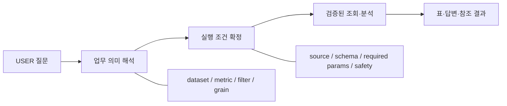
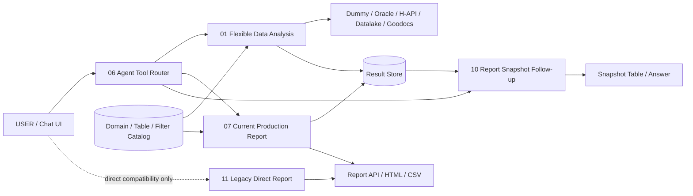
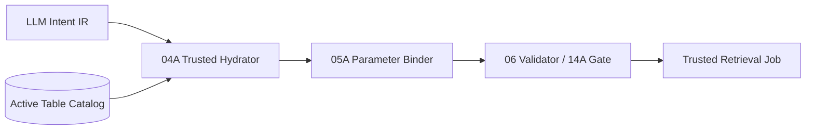
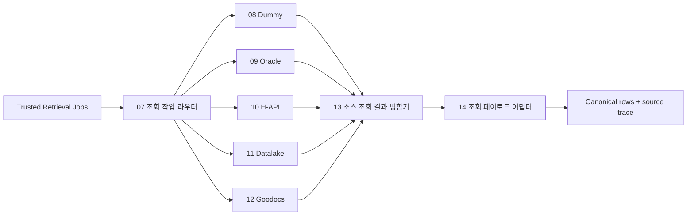
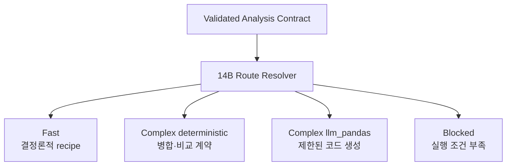
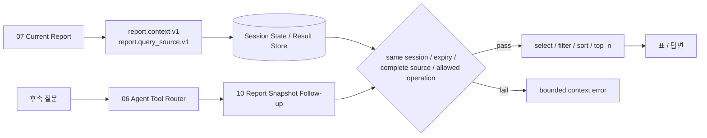
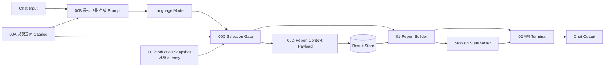
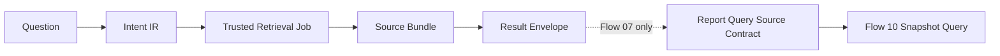

# 제조 데이터 Agent 소개 PPT 초안 — 구현 중심 새 구성

> 이 문서는 PPT 제작 전 검토하는 **스토리보드 원본**이다. 화면 양식이나 HTML 시안은 이 문서의 제약이 아니다. 현재 `metadata_driven_v5`에 구현된 Flow, Custom Component, payload contract를 기준으로 “사람의 질문이 어떤 과정을 거쳐 안전한 실행과 결과로 바뀌는가”를 설명한다.

## 1. 발표의 한 문장

제조 데이터 Agent는 질문에 바로 답하는 챗봇이 아니라, **자연어를 Metadata 기반의 검증 가능한 실행 계약으로 변환하고 그 계약을 재사용하는 실행 플랫폼**이다.

이 메시지를 두 가지 구현 방식으로 증명한다.

| 구현 방식 | 현재 v5의 대표 Flow | 설명할 가치 |
| --- | --- | --- |
| Flexible Data Analysis | `01. v5_data_analysis` | 일반 데이터 분석의 유일한 canonical Flow로서, 질문·조건·집계가 달라도 Metadata와 Typed Contract를 재사용한다. |
| Fixed Workflow Report | 현재 기본 `07`, Snapshot 후속 조회 `10`, 호환용 직접 실행 `11` | 업무 절차·판정·보고서 형식이 고정된 경우, E2E Flow로 결과와 artifact를 일관되게 만들고 같은 Snapshot을 안전하게 후속 조회한다. |

## 2. 이 초안의 사용 범위

- **권장 분량**: 본문 15장 + 기술 부록 3장, 약 30~40분
- **대상**: 제조 업무 담당자, 데이터/플랫폼 담당자, Agent 구현 검토자
- **핵심 이해 결과**
  1. Flexible Flow의 유연함은 “LLM이 모든 것을 결정한다”는 뜻이 아니라 Metadata와 계약을 재사용한다는 뜻임을 이해한다.
  2. Fixed Workflow는 Flexible Flow의 축소판이 아니라, 정해진 업무 Rule과 산출물 품질을 보장하는 별도 설계임을 이해한다.
  3. 현재 구현 범위와 향후 `live` source·Legacy 연계 범위를 분리해 이해한다.

### 현재 구현 기준

| 항목 | 현재 기준 |
| --- | --- |
| Langflow 런타임 | `Langflow 1.11.0` / `langflow-base 0.11.0` / `lfx 1.11.0` |
| import-ready bundle | 9개 Flow — `01`~`07`, `10`, `11` |
| Flexible 기본 Flow | `01` — 51 nodes / 59 edges |
| Fixed Report Flow | 현재 기본 `07` — 12 nodes / 17 edges, Snapshot 후속 `10` — 11 nodes / 13 edges |
| Legacy Report Flow | Router 미노출 `11` — 9 nodes / 11 edges, 변경 전 직접 응답 구조 보존 |
| 기본 데이터 조회 모드 | `dummy`; `live` 전환은 `04A 신뢰 카탈로그 조회 작업 구성기.retrieval_mode` 한 곳에서 제어 |

> 발표에서는 과거 번호나 다른 프로젝트의 Flow 번호를 현재 구현 사실처럼 쓰지 않는다. 이 문서의 Flow 번호는 현재 v5 import-ready bundle 기준이다.

## 3. 화면 전체에서 공통으로 쓰는 표현 규칙

기술 내용을 많이 넣더라도, 보는 사람이 **누가 무엇을 결정하는지** 먼저 읽을 수 있어야 한다.

| 표기 | 소유자 | PPT에서 의미하는 것 |
| --- | --- | --- |
| `[USER]` | 현업 사용자 | 업무 질문, 날짜·공정·대상 표현 |
| `[LLM]` | Language Model | 등록된 후보 중 dataset·필터·분석 의도를 구조화 |
| `[CATALOG / RULE]` | Metadata, Python Custom Component | source·schema·필수 파라미터·검증·분기 결정 |
| `[SOURCE]` | Dummy / Oracle / H-API / Datalake / Goodocs | 신뢰 계약에 따라 데이터를 제공 |
| `[RESULT]` | Result Store, API, Artifact | 표, trace, `result_ref`, 보고서 링크 |

JSON은 한 슬라이드에 최대 두 블록만 사용한다. 각 블록은 다음 두 가지를 같이 표시한다.

1. **누가 만든 값인가**
2. **다음 Component가 왜 이 값을 읽는가**

`SQL`, endpoint, credential, token, 대량 원본 rows, 전체 pandas code는 본문에 노출하지 않는다. 대신 이들이 왜 LLM 입력에서 빠지고 어떤 신뢰 경계에서 관리되는지를 보여준다.

---

# 본문 스토리보드

## Slide 1. 제조 데이터 Agent: 질문을 실행 가능한 계약으로 바꾼다

**제목**

`제조 데이터 Agent — Natural Language to Trusted Execution`

**이 장의 한 문장**

사람이 말한 업무 질문은 답변 문장으로 바로 가는 것이 아니라, 실행 가능한 데이터 계약으로 변환된 뒤 결과가 된다.

**화면 구성**

```text
[USER]
“오늘 DA 공정의 WIP를 제품별로 비교해줘”
                  ↓
[EXECUTION CONTRACT]
dataset · date · filter · grain · source · output shape
                  ↓
[RESULT]
표 · 답변 · trace · result_ref
```

**표현 포인트**

- 표지에는 Flow 번호, 노드 수, JSON을 넣지 않는다.
- 부제에만 `Flexible Data Analysis + Fixed Workflow`를 둔다.
- “질문을 이해하는 Agent”보다 “질문을 실행 계약으로 바꾸는 Agent”라는 관점을 선명하게 잡는다.

---

## Slide 2. 제조 데이터의 어려움은 답변 생성이 아니라 실행 조건 확정이다

**제목**

`같은 질문이라도 실행 조건이 확정되지 않으면 안전하게 조회할 수 없다`

**이 장의 한 문장**

자연어에는 dataset, source, 필터, 집계 grain, 결과 형식이 생략되어 있으므로 LLM의 문장 해석만으로 실행하면 안 된다.

**화면 구성**



**하단에 넣을 문장**

```text
LLM이 직접 신뢰 설정으로 소유하지 않는 것
SQL · source_config · endpoint · credential · 임의 물리 컬럼 · 제한 없는 pandas 실행
```

**발표 포인트**

- 질문을 “잘 해석했다”는 것과 데이터를 “안전하게 실행했다”는 것은 다른 문제다.
- v5는 이 둘 사이에 Intent, Trusted Contract, Result Envelope을 둔다.

---

## Slide 3. 업무 성격에 따라 Flexible Flow와 Fixed Workflow를 나눈다

**제목**

`변하는 질문은 Metadata로, 정해진 업무는 Workflow로 구현한다`

**이 장의 한 문장**

질문의 조건과 분석 모양이 계속 바뀌는 업무와, 절차·판정·보고서가 정해진 업무는 같은 방식으로 구현하지 않는다.

**화면 구성**

| 구분 | Flexible Data Analysis | Fixed Workflow Report |
| --- | --- | --- |
| 대표 Flow | 일반 분석의 유일한 canonical 경로 `01` | 현재 Report `07` + Snapshot 후속 `10`; 호환용 직접 실행 `11` |
| 입력 | 질문마다 달라지는 dataset·조건·집계 | 정해진 업무 요청과 공정그룹 |
| 계획 | Metadata 후보 + Intent IR + Route Resolver | Catalog + Gate + 고정 Python Rule |
| 결과 | `data.rows`, trace, `result_ref` | `report_scope`, KPI, HTML/CSV artifact |
| 확장 방식 | Metadata·Function Case 등록 | 새 업무용 E2E Flow 추가 |

**말로 풀어줄 포인트**

- Flexible Flow는 질문별 Agent를 새로 만드는 대신, Metadata와 Contract를 다시 조합한다.
- Fixed Workflow는 고정 Rule과 보고서 품질을 우선한다.
- 두 방식은 Result/API 계약과 운영 경계를 공유할 수 있다.

---

## Slide 4. 전체 시스템은 Router, Metadata, 실행 Flow, 결과 저장소로 분리된다

**제목**

`한 개의 Chatbot이 아니라, 계약으로 연결된 실행 컴포넌트 집합이다`

**이 장의 한 문장**

Router는 실행 Flow를 선택하고, Metadata는 실행의 신뢰 원천이 되며, Result Store는 대화와 대용량 결과를 분리한다.

**구조도**



**이 장에서 꼭 구분할 것**

- `06`은 일반 분석 `01`, 현재 Report `07`, Report Snapshot 후속 `10`을 선택하는 운영 Agent Tool Router다.
- 일반 데이터 분석의 canonical 실행 경로는 `01` 하나뿐이다.
- `11`은 변경 전 Report 직접 응답을 재현하는 호환 Flow이며 Router Tool로 노출하지 않는다.
- Result Store는 단순 로그가 아니라 대화창에 대량 rows를 복사하지 않기 위한 상태 참조 경계다.

---

## Slide 5. Flexible Data Analysis는 51개 노드를 여섯 개 책임 구역으로 읽는다

**제목**

`Flow 01의 복잡성은 기능 나열이 아니라 신뢰 경계의 분리다`

**이 장의 한 문장**

`01. v5_data_analysis`는 51개 노드를 한 줄로 실행하는 Flow가 아니라, 질문을 결과로 바꾸는 책임을 명시적으로 나눈 구조다.

**화면 구성: 6-zone pipeline**

```text
1. Request / State
   Chat Input · 00 분석 요청 로더 · 세션/이전 결과
        ↓
2. Metadata Candidate
   01A~01D Domain · Table Catalog · Filter · 질문 후보화
        ↓
3. Intent IR
   02 변수 생성 · 03B Catalog 검증 Intent Router · 04 정규화
        ↓
4. Trusted Contract
   04A Hydrator · 05A Binder · 06 Validator · 14A Gate
        ↓
5. Retrieve / Normalize
   07 Router · 08~12 Retriever · 13 Merge · 14 Adapter
        ↓
6. Analyze / Deliver
   14B Resolver · 15/15A Helper · 16/17/17B · 20~24 Result
```

**발표 포인트**

- 이 장에서 모든 node의 이름을 읽지 않는다.
- 다음 슬라이드부터 “사람의 질문이 어느 구역에서 어떤 JSON으로 바뀌는지”를 따라간다.

---

## Slide 6. 사람의 업무 표현은 Metadata 후보를 거쳐 Intent IR로 바뀐다

**제목**

`질문을 바로 실행하지 않고, 먼저 후보가 제한된 Intent IR로 만든다`

**이 장의 한 문장**

LLM은 전체 데이터베이스를 보지 않는다. 질문과 관련된 Metadata 후보 안에서 “무엇을 조회할지”만 Strict JSON으로 선택한다.

**좌측: 사람이 말한 것**

```text
[USER]
“오늘 DA 공정의 WIP를 제품별로 비교해줘”
```

**가운데: 01A~01D가 만드는 문맥**

```text
Domain 후보 최대 20건
Table Catalog 후보 5건
등록된 Main Flow Filter 전체
compact JSON 32 KiB 이내
```

**우측: LLM이 소유하는 Intent IR 예시**

```json
{
  "dataset_key": "wip_today",
  "source_alias": "wip_data",
  "required_params": {
    "DATE": "20260710"
  },
  "filters": {
    "OPER_NAME": {
      "operator": "in",
      "value": ["D/A1"]
    }
  }
}
```

**PPT 아래 설명**

```text
[LLM] dataset · alias · parameter value · filter meaning
[NOT LLM] source_type · source_config · SQL · endpoint · credential
```

**발표 포인트**

- Intent IR은 사용자에게 보여주는 API가 아니라 다음 Component가 읽는 내부 Typed IR이다.
- `required_params`는 job마다 독립 실행 가능한 완성 값이어야 하며, 다른 job에 암묵적으로 전파하지 않는다.

---

## Slide 7. Trusted Hydration이 LLM 해석을 실제 실행 계약으로 바꾼다

**제목**

`04A는 LLM의 선택을 믿는 곳이 아니라 Catalog로 다시 검증하는 곳이다`

**이 장의 한 문장**

Intent가 선택한 `dataset_key`는 가능성일 뿐이며, 실제 source·schema·필수 입력은 Active Table Catalog가 결정한다.

**화면 구성**



**화면에 나란히 보여줄 계약 변화**

```json
{
  "dataset_key": "wip_today",
  "filters": {
    "OPER_NAME": {
      "operator": "in",
      "value": ["D/A1"]
    }
  }
}
```

```json
{
  "dataset_key": "wip_today",
  "source_type": "oracle",
  "required_param_names": ["DATE"],
  "trusted_catalog": true,
  "catalog_ref": "table:wip_today"
}
```

**발표 포인트**

- LLM이 `source_type`, `source_config`, SQL, URL을 써도 04A는 이를 신뢰 설정으로 사용하지 않는다.
- `dummy`와 `live`의 선택도 `04A.retrieval_mode` 한 곳에서만 정하고, `07 데이터 조회 작업 라우터`는 그 값을 읽기만 한다.
- 이 경계가 Flexible Flow를 재사용 가능하게 만드는 핵심이다. 새 dataset을 추가할 때 질문별 Flow를 새로 만들지 않고 Catalog를 확장할 수 있다.

---

## Slide 8. Retriever는 전체 대화 상태가 아니라 작은 조회 작업 bundle만 받는다

**제목**

`조회는 source별로 분기하고, 결과는 canonical data로 다시 합친다`

**이 장의 한 문장**

한 질문이 여러 source를 써도 각 Retriever에는 필요한 조회 job만 전달하고, source별 반환 형식은 병합·표준화 단계에서 하나로 맞춘다.

**구조도**



**Retriever 입력 예시**

```json
{
  "retrieval_job_bundle": {
    "source_type": "oracle",
    "jobs": [],
    "retrieval_mode": "live"
  },
  "request_context": {
    "session_id": "masked-session",
    "reference_date": "20260710"
  }
}
```

**발표 포인트**

- `state`, 전체 Intent, 이전 runtime rows를 모든 source branch에 복제하지 않는다.
- 결과를 source마다 다른 DataFrame/응답 형식으로 남기지 않고, 이후 Route Resolver가 읽을 수 있는 canonical column/row 계약으로 정리한다.

---

## Slide 9. Route Resolver가 Fast, deterministic complex, LLM pandas, blocked를 구분한다

**제목**

`유연한 분석에도 LLM 호출이 필요한 경우와 필요하지 않은 경우를 분리한다`

**이 장의 한 문장**

`14B V2 단순 분석 계약 결정기`는 질문 문자열이 아니라 Typed IR, source 수, canonical schema, grain, metric, join, 출력 계약으로 실행 경로를 결정한다.

**화면 구성**



**모델 호출 기준표**

| 경로 | pandas 생성 | repair | 답변 LLM |
| --- | ---: | ---: | ---: |
| Fast | 0 | 0 | 0 |
| Blocked | 0 | 0 | 0 |
| Complex deterministic | 0 | 0 | 옵션이 켜진 경우만 1 |
| Complex `llm_pandas` | 1 | 실패 시 최대 1 | 옵션이 켜진 경우만 1 |

**안전 경계 설명**

- pandas 실행 코드는 `trace.inspection.pandas_execution.generated_code`에 남긴다.
- 정확한 `import pandas as pd`, `import numpy as np`만 정규화하고, 다른 import와 파일·네트워크 I/O는 차단한다.
- Repair는 실패한 경우에만 최대 한 번 수행한다.

---

## Slide 10. 최종 결과는 답변 문장이 아니라 Result Envelope과 참조 상태다

**제목**

`Chat 응답은 결과의 표현이고, 결과의 단일 소유자는 data.rows다`

**이 장의 한 문장**

최종 결과는 표·다운로드·후속 질문·감사를 지원할 수 있도록 API Envelope, trace, Result Store 참조로 구성된다.

**최종 API Envelope 예시**

```json
{
  "response_type": "data_analysis",
  "status": "ok",
  "data_mode": "dummy",
  "message": "사용자 표시용 Markdown",
  "data": {
    "columns": [],
    "rows": [],
    "row_count": 0
  },
  "data_refs": [],
  "trace": {}
}
```

**화면 구성**

```text
20 Hybrid Answer Builder
        ↓
21 Answer Message Adapter ──→ Chat Output
        ↓
22 API Response Builder ────→ API Client
        ↓
23 MongoDB Result Store ────→ result_ref / CSV reference
        ↓
24 Runtime Cleanup
```

**발표 포인트**

- final rows의 canonical 위치는 `data.rows`다. 같은 rows를 `analysis`나 답변 섹션에 중복 보관하지 않는다.
- 생성 pandas code는 `trace.inspection`에, 대용량 결과는 Result Store에 둔다.
- 대화창은 결과를 설명하는 표면이며, 후속 실행의 데이터 저장소가 아니다.

---

## Slide 11. Report 후속 질문은 전용 Snapshot 계약으로 이어진다

**제목**

`Flow 07이 만든 Report 데이터는 Flow 10이 같은 세션에서 제한적으로 다시 조회한다`

**이 장의 한 문장**

Report 후속 질문은 HTML이나 대화 문장을 다시 읽지 않고, `07`이 저장한 materialized query source와 허용 연산 계약을 `10`이 검증·실행한다.

**구조도**



**Report query source 계약 예시**

```json
{
  "source_alias": "report_shortage_products",
  "authoritative": true,
  "columns": ["MODE", "DENSITY", "생산실적달성율"],
  "grain": {"kind": "product", "columns": ["MODE", "DENSITY"]},
  "allowed_operations": ["select", "filter", "sort", "top_n"],
  "result_ref": "result:masked"
}
```

**발표 포인트**

- Flow 10은 Report가 실제로 저장한 물리 컬럼과 미리 생성한 View를 사용하므로 전역 컬럼 별칭을 추측하지 않는다.
- Table Catalog, Main Filter, 신규 source 조회, join, 새 groupby, 자유 pandas 실행은 이 경로에 없다.
- `현재 기준`, `최신 데이터`, `다시 조회`처럼 새 시점을 요구하면 Flow 10이 아니라 canonical 분석 Flow 01로 보낸다.
- `현재작업재공`처럼 `현재`가 Report 컬럼명의 일부인 경우에는 Snapshot 필터로 처리한다.

---

## Slide 12. 현재 기본 Fixed Workflow는 Report와 후속 Context를 함께 만든다

**제목**

`Flow 07은 완료 Snapshot을 정해진 Rule로 보고하고 Flow 10용 query source도 함께 저장한다`

**이 장의 한 문장**

현재 기본 `07. v5_realtime_production_report`는 공정그룹 선택, 검증, 고정 Rule 집계, artifact 생성, 후속 Context 저장을 하나의 E2E Flow로 묶는다.

**현재 12-node / 17-edge Flow 구조**



**발표 포인트**

- LLM은 공정그룹 후보를 선택하지만, Gate가 질문 원문과 허용목록으로 다시 검증한다.
- Report Builder는 원천 데이터의 생산 판정식을 새로 계산하지 않는다. 완료된 판정 Snapshot을 받아 고정 Rule로 집계한다.
- 00D와 Result Store가 raw/pre-aggregated query source를 참조 형태로 저장하며, 대화 메시지에는 원본 rows를 복사하지 않는다.
- 이것이 유연한 질문형 분석과 고정 업무형 Workflow의 가장 중요한 차이다.

---

## Slide 13. 현재 Flow 07과 Legacy Flow 11은 같은 Gate 뒤의 상태 계약이 다르다

**제목**

`공정그룹 Gate는 공유하지만, 현재 Flow만 후속 Snapshot 상태를 발행한다`

**이 장의 한 문장**

두 Report Flow 모두 등록된 공정그룹과 질문 근거가 정확히 하나로 일치할 때만 실행한다. 현재 기본 `07`은 Flow 10용 Context를 저장하고, `11`은 변경 전 직접 응답 구조만 재현한다.

**현재/호환 Flow 구분**

| 구분 | `07. v5_realtime_production_report` | `11. v5_realtime_production_report_legacy` |
| --- | --- | --- |
| 역할 | 현재 운영 기본 Report | 변경 전 직접 응답 재현 |
| Router 노출 | `06`의 Report Tool 대상 | 미노출; 필요할 때 직접 실행 |
| 그래프 | 12 nodes / 17 edges | 9 nodes / 11 edges |
| 후속 상태 | Context·query source·session state 저장 | 저장하지 않음 |
| 후속 질문 | `10`에서 Snapshot 조회 가능 | 지원하지 않음 |

**공정그룹 선택 결과 예시**

```json
{
  "status": "selected",
  "process_group_key": "WB",
  "reason": "질문에 W/B가 명시됨",
  "evidence": ["W/B"]
}
```

**최종 Report API 계약 예시**

```json
{
  "response_type": "realtime_production_report",
  "status": "ok",
  "report_scope": {},
  "kpis": {},
  "artifacts": [],
  "warnings": [],
  "errors": []
}
```

**발표 포인트**

- 공정그룹이 없거나 여러 개면 HTML을 만들지 않고 clarification을 반환한다.
- Workflow observation에는 원본 rows와 HTML 본문을 넣지 않고, `report_scope`, KPI, artifact descriptor, warning/error만 둔다.
- Flow 11은 호환성 검증용이므로 Router가 자동 선택하거나 Flow 10의 입력 Context를 생성하지 않는다.
- 운영 전환 시 현재 기본 Flow 07의 더미 Snapshot 노드만 완료 Snapshot Loader로 교체하며, Catalog → Gate → Builder → API 계약은 유지한다.

---

## Slide 14. 두 구현 방식은 경쟁 관계가 아니라 확장 경로가 다르다

**제목**

`새 요구사항은 “Metadata 확장”인지 “새 업무 Flow”인지 먼저 판단한다`

**이 장의 한 문장**

재사용할 수 있는 데이터 의미와 반복 업무 절차를 분리하면, Agent를 업무별 챗봇 묶음으로 만들지 않아도 된다.

**화면 구성**

| 새 요구사항 | 우선 확장 지점 | 기대 효과 |
| --- | --- | --- |
| 새 dataset·컬럼·조건 | Domain / Table Catalog / Main Filter | 기존 Flexible Flow에서 바로 후보화 가능 |
| 자주 반복되는 간단 분석 | Function Case / Fast recipe | 모델 호출 없이 빠른 deterministic 경로 |
| Report 생성 당시 데이터를 다시 보는 질문 | Flow 07 query source + Flow 10 | 신규 조회 없이 같은 Snapshot을 제한적으로 조회 |
| 정해진 E2E 업무 | 새 Fixed Workflow Flow | 업무 Rule·보고서 품질·artifact 표준화 |
| 변경 전 Report 동작 재현 | Router 미노출 Flow 11 직접 실행 | 현재 경로를 오염시키지 않고 호환성 비교 |
| Legacy 조치 | 결과 뒤의 별도 API/승인 경계 | 분석 결과와 실제 변경 작업 분리 |

**발표 포인트**

- “새 질문 = 새 Agent”가 아니라, Metadata 또는 Workflow 중 어디를 바꿔야 하는지 결정하는 구조다.
- Legacy System 조치는 분석 결과가 준비된 후 별도 권한·재시도·감사 경계를 가진 API로 연결한다.

---

## Slide 15. 현재 구현 증거와 운영 전환 범위를 함께 보여준다

**제목**

`현재는 계약과 더미 검증이 증명됐고, live 운영은 별도 전환 과제다`

**이 장의 한 문장**

현재 구현은 import-ready Flow와 `dummy` representative question 검증을 갖추고 있으며, 실제 제조 운영 전환에는 source·Snapshot·업무 숫자·보안 검증이 추가로 필요하다.

**화면 구성**

| 구분 | 현재 구현에서 확인할 것 | 운영 전환에 추가할 것 |
| --- | --- | --- |
| Flexible Data Analysis | 9개 Flow bundle, canonical Flow 01, Component source/JSON 동기화, dummy 질문 검증 | live credential·network·schema·성능 smoke test |
| Hybrid pandas | Fast/Complex/Blocked 경로, 최대 1회 repair, 코드 trace | OS 수준 격리 필요성 검토, 실제 데이터 UAT |
| Realtime Report | Flow 07 dummy Snapshot, 공정그룹 Gate, 고정 Report, 후속 query source 발행 | Golden Dataset, 업무 숫자 대조, Report API 운영 배포 |
| Report Snapshot Follow-up | Flow 10 same-session·만료·완전성·허용 연산 검증 | 실제 Agent 세션 E2E와 대표 후속 질문 UAT |
| Legacy Direct Report | Flow 11 변경 전 직접 응답 그래프, Router 미노출 | 필요 기간·폐기 기준과 호환성 비교 범위 확정 |

**마무리 문장**

> `dummy` 경로의 통과는 Flow 계약이 작동한다는 증거다. 실제 제조 데이터의 업무 정확도·권한·성능·운영 안정성은 `live` 전환에서 별도로 검증한다.

---

# 기술 부록

## Appendix A. 현재 import-ready Flow 맵

| 번호 | Flow | nodes / edges | 발표에서의 위치 |
| ---: | --- | ---: | --- |
| 01 | `v5_data_analysis` | 51 / 59 | Flexible Data Analysis 기본 경로 |
| 02 | `v5_domain_saving` | 12 / 13 | Domain Metadata 등록 |
| 03 | `v5_table_catalog_saving` | 12 / 13 | Table Catalog 등록 |
| 04 | `v5_main_flow_filter_saving` | 12 / 13 | Main Filter 등록 |
| 05 | `v5_metadata_qa` | 11 / 17 | Metadata 질의/검증 |
| 06 | `v5_agent_tool_router` | 11 / 10 | 운영 Agent Tool 진입; `01`·`07`·`10` 선택 |
| 07 | `v5_realtime_production_report` | 12 / 17 | 현재 기본 Fixed Workflow Report |
| 10 | `v5_report_followup` | 11 / 13 | 같은 세션의 Report Snapshot 후속 조회 |
| 11 | `v5_realtime_production_report_legacy` | 9 / 11 | Router 미노출 변경 전 직접 Report |

**PPT 사용 규칙**

- 본문에서는 canonical 분석 `01`, 현재 Report `07`, Snapshot 후속 `10`을 크게 다룬다. `11`은 호환성 설명에서만 구분한다.
- `02`~`05`는 Flexible Flow의 재사용성을 가능하게 하는 Metadata 관리 Flow로 한 줄만 연결한다.
- 전체 Canvas 스크린샷을 그대로 넣기보다, Slide 5의 책임 구역 구조와 함께 이 표를 부록에 둔다.

---

## Appendix B. 질문에서 결과까지의 JSON 계약 연결선



| 단계 | owner | 다음 단계에 전달하는 핵심 값 |
| --- | --- | --- |
| Question | USER | `question`, `session_id`, `reference_date` |
| Intent IR | LLM | `dataset_key`, `source_alias`, `required_params`, `filters` |
| Trusted Job | CATALOG / RULE | `source_type`, `required_param_names`, `trusted_catalog`, `catalog_ref` |
| Source Bundle | SOURCE / RULE | source별 결과, canonical schema, routing trace |
| Result Envelope | RESULT | `data.rows`, `data_refs`, `trace`, `result_ref` |
| Report Query Source | RULE / RESULT | `source_alias`, 물리 `columns`, `grain`, `allowed_operations`, `result_ref` |

**발표 시 강조할 단일 원칙**

```text
LLM이 만든 값은 “의미 선택”이고,
Catalog와 Rule이 만든 값이 “실행 가능한 사실”이다.
```

---

## Appendix C. PPT 제작 전 기술 정확성 체크리스트

- [ ] Flexible Flow의 기본 source가 `dummy`임을 숨기지 않고, `live` 전환과 구분했는가
- [ ] `04A`가 source trust와 `retrieval_mode`의 단일 제어점임을 설명했는가
- [ ] `07 데이터 조회 작업 라우터`가 별도 mode input을 가진다고 잘못 표현하지 않았는가
- [ ] LLM이 source_config, SQL, endpoint, credential을 신뢰 설정으로 결정한다고 보이지 않는가
- [ ] `data.rows`가 최종 rows의 canonical 위치라고 설명했는가
- [ ] pandas는 모든 질문의 기본 실행기가 아니라 Complex `llm_pandas` 경로의 제한된 escape hatch라고 설명했는가
- [ ] Flow 10이 대화 문장이나 HTML이 아니라 같은 세션의 `result_ref`와 Report query source 계약을 검증한다고 설명했는가
- [ ] Fixed Report가 원천 생산 판정을 재계산하지 않고 완료 Snapshot을 고정 Rule로 집계한다고 설명했는가
- [ ] HTML 본문과 원본 rows를 Workflow observation에 넣지 않는 경계를 설명했는가
- [ ] Flow 수·노드 수·런타임 버전을 현재 `import_ready_flows/manifest.json` 기준으로 확인했는가

## 구현 근거 파일

- Flow inventory / runtime / validation: `import_ready_flows/manifest.json`
- Flexible Data Analysis export: `flow_exports/data_analysis_flow_v2_standalone.json`
- Flexible Flow 연결 가이드: `langflow_components/data_analysis_flow_v2/CONNECTION_GUIDE.md`
- Payload ownership / trust boundary: `docs/V5_PAYLOAD_CONTRACT.md`
- Current Fixed Report export: `flow_exports/07_realtime_production_report_flow_v5_standalone.json`
- Report Snapshot Follow-up export: `flow_exports/10_report_followup_flow_v5_standalone.json`
- Legacy Direct Report export: `flow_exports/11_realtime_production_report_legacy_flow_v5_standalone.json`
- Report 후속 분리 설계: `docs/REPORT_FOLLOWUP_FLOW_DESIGN.md`
- Fixed Report 운영 경계: `docs/REALTIME_PRODUCTION_REPORT_PRODUCTION_IMPLEMENTATION_GUIDE.md`

이 초안의 목적은 구현을 단순화하거나 숨기는 것이 아니다. 복잡한 구현을 **질문 → 계약 → 신뢰 경계 → 실행 → 결과 참조**라는 순서로 재배치해, 기술 담당자와 업무 담당자가 같은 구조를 이해하도록 만드는 것이다.
