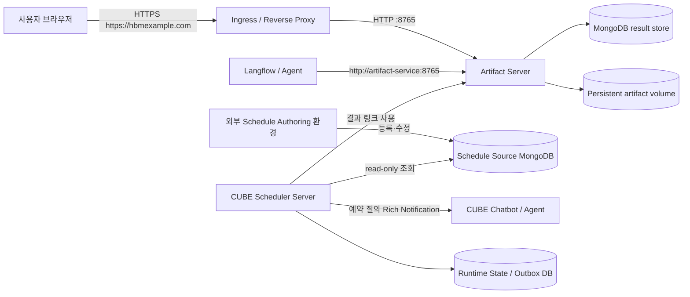
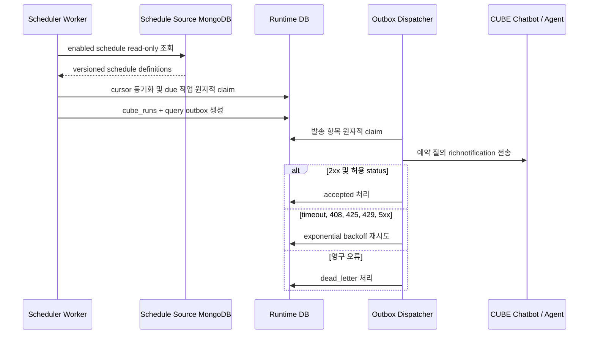

# Data/HTML Artifact 서버와 CUBE Scheduler 서버 설계

## 1. 설계 결론

요청한 기능은 다음 두 개의 **논리적으로 분리된 FastAPI 서비스**로 구현한다. 두 서버 모두 FastAPI application과 Uvicorn을 표준 실행 기반으로 사용한다.

1. **Artifact Server**
   - 기존 `tools/data_ref_download_server.py`의 DATA CSV 다운로드와 HTML Report 등록·보기·다운로드 계약을 담당한다.
   - 기존 URL 계약은 유지하되 FastAPI/Uvicorn 기반의 운영형 서버로 정리한다.
   - 프로세스 자동 복구, 제한 시간, 메모리 상한, readiness, 주기적 정리, 구조화 로그를 추가한다.
2. **CUBE Scheduler Server**
   - 외부 환경이 등록한 스케줄을 read-only로 조회하고, 예약 질의를 CUBE 챗봇에 전달해 Agent 실행을 요청한다.
   - FastAPI lifespan에서 schedule reader, due-job executor, outbox dispatcher의 시작과 정상 종료를 관리한다.
   - 스케줄 원본과 서버 실행 상태를 서로 다른 저장소·권한으로 분리한다.
   - 실행과 CUBE 발송을 요청 처리와 분리하고, 원자적 claim과 durable outbox로 재시도한다.

두 서비스는 배포·장애·확장 단위를 분리한다. CUBE 작업 실패가 DATA/HTML 다운로드에 영향을 주지 않고, 대용량 다운로드가 스케줄 실행을 막지 않게 하기 위해서다.

### 1.1 구현 상태

이 설계의 1차 운영 구현은 다음 위치에 반영했다.

- `artifact_server/`: FastAPI Artifact Server
- `cube_scheduler_server/`: FastAPI CUBE Scheduler Server와 durable runtime/outbox
- `langflow_components/cube_schedule_saving_flow/`: source schedule 작성용 standalone component
- `flow_exports/cube_schedule_saving_flow_v5_standalone.json`: 12번 원본 Flow
- `import_ready_flows/12_cube_schedule_saving_flow_v5_standalone.json`: import-ready Flow

실행 설정과 배포 경계는 [FASTAPI_SERVERS_OPERATIONS_GUIDE.md](FASTAPI_SERVERS_OPERATIONS_GUIDE.md)에 정리한다. 프록시 SSO, TLS, 서명된 단기 data_ref처럼 회사 인프라와 인증 방식이 필요한 항목은 앱 내부에서 임의 구현하지 않고 배포 계층의 필수 조건으로 남긴다.

## 2. 주소를 세 종류로 구분한다

`http://127.0.0.1:8765`와 `https://hbmexample.com`은 서로 대체 관계가 아니라 용도가 다르다.

| 구분 | Artifact Server 예시 | 용도 |
| --- | --- | --- | --- |
| Listen address | `0.0.0.0:8765` | 서버 프로세스가 내부에서 요청을 받는 주소 |
| Internal service URL | `http://artifact-service:8765` | Langflow/Agent가 같은 사내망에서 `POST /reports`를 호출하는 주소 |
| Public base URL | `https://hbmexample.com` | 사용자가 CUBE/GaiA에서 클릭할 `view_url`, `download_url` 생성 기준 |

권장 운영 구성은 다음과 같다.



Artifact Server 설정은 최소한 아래 두 값을 분리한다.

```env
ARTIFACT_LISTEN_HOST=0.0.0.0
ARTIFACT_LISTEN_PORT=8765
ARTIFACT_PUBLIC_BASE_URL=https://hbmexample.com
```

Langflow의 `report_api_url`은 내부 service URL을 사용하고, `download_base_url` 또는 서버가 응답에 넣는 공개 링크는 public base URL을 사용한다. `0.0.0.0`은 URL에 넣지 않는다.

두 서비스를 같은 DNS로 내보내야 한다면 `/artifacts`와 `/cube` prefix를 사용할 수 있지만, 가능하면 인증·로그·배포 경계를 명확히 하기 위해 별도 내부 DNS를 권장한다.

## 3. 현재 Artifact Server 진단

현재 구현은 다음 부분은 이미 적절하다.

- MongoDB database/collection/path allowlist
- 만료된 `data_ref`의 `410 Gone`
- HTML/metadata 임시 파일 작성 후 원자적 rename
- HTML 크기·전체 저장소 크기·TTL 제한
- Report access token 지원 및 query token 로그 마스킹
- 동일 서비스 확인 후 graceful shutdown, 전용 포트 강제 교체 기능
- DATA CSV와 HTML Report의 기존 route 계약

다만 코드만으로 실제 운영 서버가 종료된 원인을 확정할 수는 없다. 운영 로그의 종료 코드, OOM 이벤트, 콘솔 세션 종료, 배포 플랫폼 재시작 이력을 먼저 수집해야 한다. 현재 코드에서 장애 가능성이 큰 지점은 아래와 같다.

| 위험 | 현재 상태 | 설계 조치 |
| --- | --- | --- |
| 프로세스 생존 | 콘솔에서 단일 Python 프로세스로 실행 | Kubernetes/systemd/Windows Service가 자동 재시작 담당 |
| 과도한 메모리 | Mongo rows와 CSV 전체를 메모리에 만든 뒤 byte 상한 검사 | 조회 상한 선검증, 동시 다운로드 제한, CSV streaming, 프로세스 메모리 제한 |
| 느린 요청 | request body/socket 제한 시간이 명시되지 않음 | reverse proxy와 앱의 read/write/keep-alive timeout 적용 |
| 상태 확인 | `/health`가 프로세스 정보만 반환 | `/live`, `/ready` 분리; ready에서 저장소 쓰기 가능 여부와 Mongo ping 확인 |
| 정리 작업 | 시작 또는 새 Report 등록 때만 정리 | 독립적인 주기 정리 작업과 정리 결과 metric 추가 |
| 종료 처리 | SIGTERM에 대한 앱 수준 drain/정리 계약 없음 | 신규 요청 차단, 진행 요청 drain, state 정리 후 종료 |
| 다중 replica | 파일 lock이 프로세스 내부 lock | 초기에는 replica 1 + Persistent Volume, HA 단계에서 MinIO/GridFS로 이전 |
| 인증 | Report token 기본값이 꺼져 있고 data_ref token은 서명되지 않은 base64 | 프록시 SSO/IP 제한 + Report token 기본 ON + 서명된 단기 data_ref token |
| 운영 로그 | 표준 출력 문자열 중심 | JSON log, request ID, latency, status, bytes, masked token, exit reason 기록 |
| 포트 강제 종료 | 기본 활성화 | 로컬 개발만 허용; 운영은 process supervisor rolling restart 사용 |

### 3.1 Artifact Server의 유지할 API

하위 Flow와 기존 링크를 깨지 않기 위해 다음 route를 유지한다.

```text
GET    /health                         호환용 상태 확인
GET    /live                           프로세스 생존 확인
GET    /ready                          MongoDB/저장소 readiness
GET    /download.csv?download_ref=...  DATA CSV 다운로드
GET    /download.json?download_ref=... data_ref 진단용 JSON
GET    /view?download_ref=...          제한된 DATA 미리보기
POST   /reports                        HTML Report 등록
GET    /reports/view/{report_id}       HTML Report 보기
GET    /reports/download/{report_id}   HTML Report 다운로드
DELETE /reports/{report_id}            HTML Report 삭제
```

`/__control/shutdown`과 전용 포트 강제 교체는 개발 launcher 호환용으로만 남기고 외부 route에서 차단한다.

### 3.2 Artifact Server 내부 구조

기존 `report_api/server.py`와 `tools/data_ref_download_server.py`에 중복된 HTML 저장 로직을 하나의 core로 합친다.

```text
artifact_server/
  app.py                 FastAPI routes, lifespan, exception mapping
  config.py              listen/internal/public URL과 용량·timeout 설정
  data_ref_service.py    data_ref 검증, Mongo 조회, CSV streaming
  report_service.py      HTML/metadata 저장, 조회, TTL, 삭제
  auth.py                signed data_ref 및 report token 검증
  health.py              live/ready 검사
  cleanup.py             만료/고아 파일 주기 정리
  logging.py             token 마스킹 구조화 로그
```

기존 `tools/data_ref_download_server.py`는 당장 삭제하지 않고 새 앱을 실행하는 개발용 launcher/호환 wrapper로 축소한다. Flow의 Python component와 Flow JSON 기본값은 Langflow 1.9.2 기준으로 함께 갱신한다.

### 3.3 안정성 정책

- MongoDB 연결에는 server selection, connect, socket, query 제한 시간을 각각 둔다.
- 다운로드는 전역 semaphore로 동시 실행 수를 제한한다. 초기 권장값은 `4`이다.
- 응답 byte 제한을 가능한 한 생성 전에 검사하고, CSV는 iterator 기반으로 전송한다.
- Mongo 단일 문서에 대용량 row array를 계속 저장하는 1단계에서는 행 수/문서 크기 상한을 명시한다.
- 결과가 커지는 단계에서는 row payload를 GridFS 또는 사내 S3 호환 MinIO로 옮기고 `data_ref`는 위치 descriptor만 가진다.
- HTML 파일 저장소를 로컬 경로로 쓸 때 Artifact Server는 replica 1로 고정한다.
- readiness 실패는 새 트래픽만 차단하고, liveness는 프로세스가 deadlock일 때만 재시작시킨다.
- 운영에서는 `--force-replace-port`를 사용하지 않는다. 배포 플랫폼이 SIGTERM과 재시작을 담당한다.

## 4. CUBE Scheduler Server 설계

CUBE Scheduler Server도 FastAPI/Uvicorn 서버로 구현한다. 스케줄 실행을 FastAPI route 함수나 `BackgroundTasks`에 직접 맡기지 않는다. HTTP route는 상태·진단 조회와 필요한 callback ACK만 처리하고, lifespan이 시작한 durable worker가 외부 MongoDB의 스케줄을 읽어 실행 대상을 만든다. 이렇게 해야 HTTP client 연결 종료나 API 요청 실패와 무관하게 작업을 복구할 수 있다.

### 4.1 스케줄 원본과 실행 서버의 책임 분리

스케줄 등록·수정·중지·삭제는 별도 환경의 Schedule Authoring 시스템이 담당한다. CUBE Scheduler Server는 authoring API를 제공하지 않고, 외부 MongoDB collection에 read-only 계정으로 접속해 활성 스케줄을 조회한다.

| 책임 | 외부 Schedule Authoring 환경 | CUBE Scheduler Server |
| --- | --- | --- |
| 스케줄 등록·수정·삭제 | 수행 | 수행하지 않음 |
| schema 검증 후 저장 | 수행 | 읽을 때 재검증 |
| 활성 스케줄 조회 | 필요 시 수행 | read-only 수행 |
| `next_run_at` 계산 | 미리 저장 가능하나 기준값은 아님 | 정의로부터 계산 |
| 예약 질의 CUBE 전달 | 수행하지 않음 | 수행 |
| 실행 이력·재시도·outbox | 수행하지 않음 | 별도 runtime 저장소에 기록 |

연결과 권한도 분리한다.

```env
CUBE_SCHEDULE_SOURCE_MONGODB_URI=mongodb://readonly-user@schedule-host:27017
CUBE_SCHEDULE_SOURCE_DATABASE=cube_authoring
CUBE_SCHEDULE_SOURCE_COLLECTION=cube_schedules

CUBE_RUNTIME_MONGODB_URI=mongodb://runtime-user@runtime-host:27017
CUBE_RUNTIME_DATABASE=cube_scheduler_runtime
```

`CUBE_SCHEDULE_SOURCE_*` 계정에는 `find` 권한만 부여한다. 실행 서버가 source document의 `next_run_at`, 상태, 오류 내용을 갱신하지 않는다.

필수 업무 입력은 요청대로 아래 세 가지다.

- `employee_id`: 작업자 사번
- `question`: Agent에 전달할 사용자 질의
- `schedule`: 주기 정의

CUBE 발송에는 `channel_id`도 필요하다. source document에는 `channel_id`를 함께 저장하는 것을 기본 계약으로 한다.

- source document에 `channel_id`가 있으면 그대로 사용한다.
- 없으면 runtime 저장소의 기존 `employee_id -> channel_id` 매핑을 조회할 수 있다.
- 둘 다 없으면 해당 스케줄을 실행하지 않고 `invalid_definition` 진단 상태로 기록한다. source document는 수정하지 않는다.

schedule은 사용하기 쉬운 interval과 고급 cron을 모두 허용한다.

```json
{
  "schedule_id": "schedule-123",
  "version": 3,
  "employee_id": "2000000",
  "channel_id": "500000000",
  "question": "현재 WIP 상위 제품과 병목 공정을 알려줘",
  "schedule": {
    "type": "interval",
    "minutes": 5,
    "timezone": "Asia/Seoul"
  },
  "enabled": true,
  "updated_at": "2026-08-05T01:00:00Z"
}
```

```json
{
  "schedule_id": "schedule-456",
  "version": 1,
  "employee_id": "2000000",
  "channel_id": "500000000",
  "question": "전일 생산 판정 Report를 만들어줘",
  "schedule": {
    "type": "cron",
    "expression": "0 8 * * 1-5",
    "timezone": "Asia/Seoul"
  },
  "enabled": true,
  "updated_at": "2026-08-05T01:00:00Z"
}
```

운영 기본 정책은 다음과 같다.

- interval 최소값: 5분
- cron: 표준 5-field 형식만 허용
- timezone: 기본 `Asia/Seoul`, runtime에 계산되는 `next_run_at`은 UTC
- 같은 schedule의 동시 실행: 1개
- 실행이 밀린 경우: 누락 횟수만큼 몰아서 실행하지 않고 가장 최근 1회로 coalesce
- 전체 worker concurrency: 초기값 1, 안정화 후 설정으로 확대
- CUBE connect/read timeout: 설정값으로 분리
- 동일 실행 식별자: `{schedule_id}:{scheduled_for_utc}`
- `version` 또는 definition hash가 바뀌면 runtime cursor를 새 정의에 맞게 재계산

schedule source는 10~30초 polling을 기본으로 한다. MongoDB replica set과 운영 승인이 있으면 Change Stream을 최적화로 사용할 수 있지만, 연결이 끊겨도 polling으로 복구할 수 있어야 한다.

### 4.2 API 계약

```text
GET    /live
GET    /ready
GET    /api/v1/schedules
GET    /api/v1/schedules/{schedule_id}
GET    /api/v1/schedules/{schedule_id}/runs
POST   /api/cube/callback
```

`GET /api/v1/schedules`는 source document를 수정하지 않는 진단용 projection만 반환한다. 등록·수정·pause·resume·delete API는 외부 Schedule Authoring 환경의 책임이므로 이 서버에 만들지 않는다.

### 4.3 저장 collection

Schedule source와 runtime 저장소를 분리한다.

| 저장소 | Collection | 핵심 필드 | 권한/주요 index |
| --- | --- | --- | --- |
| 외부 source | `cube_schedules` | schedule_id, version, employee/channel, question, schedule, enabled, updated_at | 서버 read-only, `schedule_id unique`, `(enabled, updated_at)` |
| runtime | `cube_schedule_cursors` | observed_version/hash, last_scheduled_for, next_run_at, validation status | read-write, `schedule_id unique`, `(next_run_at, status)` |
| runtime | `cube_runs` | scheduled_for, status, attempt, error, started/finished | `dedupe_key unique`, `(schedule_id, scheduled_for)` |
| runtime | `cube_outbox` | rendered query payload, status, attempts, next_attempt_at, lease | `(status, next_attempt_at)`, `dedupe_key unique` |
| runtime | `cube_inbound_events` | message_id, employee/channel, raw payload hash, status | `message_id unique`, TTL |
| runtime | `cube_user_channels` | employee_id, channel_id, last_seen_at | `employee_id unique` |

원본 BOT token, API key, Mongo URI는 문서에 저장하지 않고 secret/environment configuration으로만 주입한다.

실행 서버에 어떠한 writable durable 저장소도 허용하지 않으면 재시작 후 중복 전송 방지, retry, lease 복구를 보장할 수 없다. 따라서 schedule source는 read-only로 유지하되 runtime 저장소는 반드시 별도로 둔다. 단일 서버 개발용 SQLite는 가능하지만 운영 기본값은 별도 MongoDB runtime database로 한다.

### 4.4 스케줄 실행 흐름



worker는 source에서 읽은 정의를 runtime cursor로 projection한 뒤 `next_run_at`이 지난 작업을 `(next_run_at, schedule_id)` 순서로 claim한다. source collection을 5분마다 전체 순회하는 단순 loop 대신 `updated_at/version` 증분 polling과 주기적 full reconciliation을 함께 사용한다.

runtime claim은 `find_one_and_update`로 lease를 동시에 기록한다. 프로세스가 CUBE 전송 중 종료되면 lease 만료 후 다른 worker가 같은 실행을 복구하되, `cube_runs`와 `cube_outbox`의 dedupe unique index가 중복 발송을 막는다.

### 4.5 CUBE Agent 실행 요청 계약

CUBE 챗봇에 예약 질의를 전달하는 것이 Agent 실행 요청이다. 별도의 Langflow Agent API를 직접 호출하지 않는다.

```json
{
  "kind": "scheduled_query",
  "employee_id": "2000000",
  "channel_id": "500000000",
  "question": "현재 WIP 상위 제품과 병목 공정을 알려줘",
  "schedule_id": "schedule-123",
  "run_id": "run-456",
  "dedupe_key": "schedule-123:2026-08-05T10:00:00Z"
}
```

`CubeRenderer`가 이 내부 모델을 실제 `richnotification` payload로 변환한다. CUBE가 HTTP 성공과 허용 status를 반환하면 서버의 책임 범위에서는 Agent 실행 요청이 접수된 것으로 처리한다. 이후 CUBE 내부 Agent 처리 실패와 사용자 fallback은 CUBE 챗봇의 책임이다.

### 4.6 Callback과 fallback

첨부 예제의 `/qna`는 동기 처리 예제지만 운영 서버에서는 다음처럼 바꾼다.

1. payload 크기, 구조, sender/channel, message ID를 검증한다.
2. 가능한 경우 CUBE 측 인증 서명 또는 사내 proxy identity를 검증한다.
3. `!@#HelloChatBot#@!`는 기존 가이드대로 `ignored` 처리한다.
4. `employee_id -> channel_id`를 갱신한다.
5. callback event를 unique message ID로 저장한다.
6. CUBE에는 빠르게 ACK한다.

fallback은 예외를 삼키고 성공처럼 끝내는 것이 아니라 outbox 상태로 관리한다.

- CUBE 408/425/429/5xx 또는 연결 오류: exponential backoff 재시도
- CUBE 4xx 인증/형식 오류: 즉시 dead letter, 운영 알림
- 성공 HTTP라도 CUBE body status가 허용 목록 밖이면 실패 처리
- 최종 전송 실패는 run/outbox를 dead letter로 남기고 CUBE 외부 운영 채널로 알림
- CUBE가 접수한 이후 Agent 내부 오류는 CUBE 챗봇의 fallback 정책을 사용

첨부된 `HttpCubeTransport`와 `CubeOutboxDispatcher`의 책임 분리는 재사용할 가치가 있다. 다만 붙여넣기 과정에서 `from future`, `init`처럼 문법이 손실된 예제이므로 원문을 그대로 복사하지 않고 이 저장소 계약에 맞춰 새로 구현한다.

## 5. CUBE Scheduler Server 내부 구조

```text
cube_scheduler_server/
  app.py                 FastAPI와 lifespan
  config.py              schedule source/runtime/CUBE/timeout 설정
  api/schedules.py       read-only 스케줄·실행상태 projection
  api/callback.py        CUBE inbound callback
  models.py              Pydantic request/domain model
  schedule_source.py     외부 MongoDB read-only 조회와 schema 검증
  runtime_store.py       cursor, claim, lease, run/outbox 상태 전이
  scheduler.py           source 동기화, next_run_at 계산, due-job claim
  renderer.py            text/rich notification 렌더링
  cube_transport.py      CUBE outbound HTTP와 응답 분류
  outbox.py              retry/backoff/dead-letter
  worker.py              scheduler + executor + dispatcher loop
```

초기 운영은 하나의 FastAPI application에서 API와 durable worker를 함께 실행한다.

- 초기 배포: Uvicorn process 1개, FastAPI API 1개, lifespan worker concurrency 1
- FastAPI 종료 시: 신규 claim 중단, 실행 중 lease 정리/연장, outbox flush 제한 시간 적용 후 종료
- 확장 단계: FastAPI API process를 늘리거나 worker 실행을 별도 process로 분리할 수 있음
- Uvicorn worker 수가 늘어도 Mongo lease/dedupe가 중복 실행과 중복 발송을 막아야 함
- 별도 worker process는 HTTP 서버가 아니라 동일 domain service의 실행 모듈이며, 외부 API 서버는 계속 FastAPI를 사용함

## 6. 보안 경계

- 외부 사용자 링크와 callback은 HTTPS reverse proxy 뒤에서만 노출한다.
- schedule 조회/실행이력 API는 사내 SSO 또는 service token 권한이 있어야 한다.
- schedule source 연결 계정에는 read-only 권한만 부여하고 runtime DB 계정과 공유하지 않는다.
- CUBE callback은 제공되는 서명 검증을 우선하고, 없다면 IP allowlist + proxy 인증 + body size 제한을 적용한다.
- CUBE outbound URL은 allowlist된 고정 설정만 사용해 SSRF를 막는다.
- BOT token과 두 Mongo URI는 secret store에서 주입한다.
- query token, CUBE token, API key, 원본 질문의 민감정보는 access log에 남기지 않는다.
- Report view는 self-contained HTML만 허용하고 기존 CSP를 유지한다.
- schedule 변경과 수동 실행에는 actor, 변경 전/후, timestamp를 audit log로 남긴다.

## 7. 배포와 복구

권장 운영 우선순위는 Kubernetes, 사내 표준이 아니라면 Linux systemd 또는 Windows Service/NSSM이다. 단순 콘솔 실행을 운영 방식으로 사용하지 않는다.

Artifact Server 초기 배포:

- replica 1
- Persistent Volume에 HTML/metadata 저장
- liveness `/live`, readiness `/ready`
- `restartPolicy: Always`
- CPU/memory request와 limit
- graceful termination 시간은 진행 중 다운로드를 고려해 30~60초
- Ingress가 `https://hbmexample.com`을 `artifact-service:8765`로 전달

CUBE Scheduler Server 초기 배포:

- FastAPI/Uvicorn replica 1, Uvicorn worker 1, lifespan worker concurrency 1
- 외부 schedule source MongoDB는 read-only 연결
- 별도 runtime MongoDB에 cursor, run, outbox durable state 저장
- worker heartbeat와 queue depth metric
- 재시작 후 expired lease 복구
- schedule source/runtime MongoDB와 CUBE outbound network만 허용

필수 metric은 다음과 같다.

- Artifact: request count/latency/status, bytes, active downloads, Mongo latency, storage bytes, cleanup count, process RSS
- Scheduler: source sync lag/error, invalid definition, due/claimed/accepted/failed, schedule lag, lease recovery, outbox retry/dead-letter, CUBE delivery latency

## 8. 구현 순서

### Phase 0. 실제 종료 원인 계측

1. 현재 8765 프로세스를 supervisor 아래에서 실행한다.
2. PID, 시작/종료 시각, exit code, stderr, 메모리 peak를 수집한다.
3. OS/container의 OOM, health probe, 배포 재시작 이벤트를 확인한다.
4. 대용량 CSV, 느린 client, Mongo timeout, 디스크 full을 재현한다.

### Phase 1. Artifact Server 안정화

1. HTML 저장 core 중복을 제거한다.
2. FastAPI route로 기존 계약을 이식한다.
3. internal/public URL 설정을 분리한다.
4. streaming, concurrency limit, timeouts, live/ready, signal drain을 구현한다.
5. 기존 `tests/test_data_ref_download_server.py`와 `tests/test_report_api_server.py`를 통합 계약 테스트로 유지한다.
6. Flow Python/JSON의 기본 URL을 동기화하고 Langflow 1.9.2 import 검증을 수행한다.

### Phase 2. Scheduler core

1. 외부 schedule source schema와 read-only adapter를 구현한다.
2. version/hash 증분 polling과 full reconciliation을 구현한다.
3. interval/cron의 runtime `next_run_at` 계산을 검증한다.
4. 별도 runtime DB의 cursor, atomic claim, lease expiry, dedupe, coalesce, run history를 구현한다.
5. fake source/fake clock으로 순차 실행과 재시작 복구를 검증한다.

### Phase 3. CUBE 연동

1. callback parser와 employee/channel mapping을 구현한다.
2. `scheduled_query` renderer를 구현한다.
3. CUBE transport, outbox, retry/dead-letter를 구현한다.
4. Postman payload와 mock CUBE API로 질의 전달 계약을 검증한다.

### Phase 4. 운영 전환

1. 개발 DNS/Ingress와 secret을 연결한다.
2. 외부 source의 개발용 schedule을 읽는 dry-run으로 실행시각과 payload만 검증한다.
3. 지정 테스트 사번/채널에 실제 발송한다.
4. 5분 interval, 평일 cron, source 수정/중지/삭제, 서버 재시작, CUBE timeout/429/500을 검증한다.
5. 모니터링과 rollback 절차를 확정한 뒤 운영 DNS로 전환한다.

## 9. 필수 검증 항목

Artifact Server:

- 기존 DATA CSV/JSON/view URL 호환
- HTML create/view/download/delete와 TTL
- public URL이 `127.0.0.1`이 아닌 실제 DNS로 생성됨
- 0행, 최대 크기, 크기 초과, Mongo timeout, 만료, 잘못된 path
- 동시 다운로드와 client disconnect에서 RSS가 상한 안에 유지됨
- SIGTERM 중 신규 요청 차단 및 진행 요청 drain
- 재시작 후 기존 HTML/metadata 조회 가능

CUBE Scheduler Server:

- interval/cron/timezone/DST 계산
- source read-only 권한과 source document 무변경 검증
- version 변경/disable/delete의 runtime cursor 반영
- 필수 3필드와 channel mapping, 잘못된 source document 격리
- 같은 due job을 여러 worker가 동시에 보아도 1회만 실행
- worker 종료 후 lease 만료 복구
- 긴 CUBE 전송의 중복 방지와 backlog coalesce
- CUBE timeout/429/500 재시도 및 4xx dead letter
- callback 중복 message ID 처리
- 예약 질의의 중복 발송 방지
- raw HTML/rows/token이 scheduler payload와 log에 남지 않음

## 10. 구현 전에 확정할 외부 정보

아래 정보는 코드에서 추정하면 안 되고 개발 연동 전에 받아야 한다.

1. Artifact와 CUBE callback의 실제 개발/운영 DNS 및 path
2. CUBE outbound API 개발/운영 URL, 성공 body 규격, callback 인증/서명 규격
3. BOT ID/token 발급 방식과 secret 주입 방식
4. employee ID만으로 channel ID를 조회할 사내 API가 있는지 여부
5. 외부 schedule source MongoDB 주소, database/collection, read-only 계정, 최종 schema
6. runtime MongoDB 제공 위치와 실행 이력 보존 기간
7. 운영 배포 플랫폼(Kubernetes/systemd/Windows Service)과 Persistent Volume 제공 여부
8. 진단 조회 API에 사용할 관리 인증 방식

외부 정보가 오기 전에도 Phase 0, Artifact Server core 통합, schedule source adapter interface, runtime claim/outbox의 fake 기반 구현과 테스트는 진행할 수 있다.
