# Metadata Saving Flow Implementation Guide

> 2026-07-10 현재 v5 기준: `원문 -> 추출 Agent 1회 -> 정규화 -> Existing Loader + 후보 key 정확 조회 -> 단일 결정론 Writer -> 단일 Response/Chat Output` 순서입니다. dry/live 그래프 분기와 별도 review Agent는 제거했습니다. Existing Loader의 full document는 Matcher에만 전달하고 Request/LLM payload에는 싣지 않습니다. 실제 pause/resume 상태가 없는 `ask`는 제거했으며 기본 중복 action은 `skip`입니다. 정확한 연결은 각 Flow의 `CONNECTION_GUIDE.md`와 `flow_exports/*_saving_flow_v5_standalone.json`을 기준으로 합니다.

> 실제 Langflow node 연결표와 custom component 파일은 각 flow 폴더에 있습니다.
>
> - `langflow_components/domain_saving_flow/CONNECTION_GUIDE.md`
> - `langflow_components/table_catalog_saving_flow/CONNECTION_GUIDE.md`
> - `langflow_components/main_flow_filters_saving_flow/CONNECTION_GUIDE.md`
>
> 현업 작업자가 그대로 복사해 넣을 수 있는 자연어 입력 예시는 각 saving flow 폴더에 나누어 둡니다.
>
> - `langflow_components/domain_saving_flow/raw_text_input_example.md`
> - `langflow_components/table_catalog_saving_flow/raw_text_input_example.md`
> - `langflow_components/main_flow_filters_saving_flow/raw_text_input_example.md`

이 문서는 현업 작업자가 코딩이나 Langflow flow 수정을 하지 않고도 자연어 설명으로 `domain`, `table_catalog`, `main_flow_filters` metadata를 MongoDB에 등록할 수 있게 만드는 saving flow 구현 가이드다.

목표는 사용자가 다음처럼 말하면:

```text
W/B공정은 W/B1부터 W/B6까지야.
재공 수량은 WIP 컬럼을 합산해서 보면 되고, 오늘 재공 데이터는 wip_today를 써.
DATE는 WORK_DT랑 연결돼.
```

Agent가 이 설명을 정제하고, 저장 가능한 JSON 문서로 변환하고, 필수 정보가 충분한지 검수한 뒤, MongoDB에 현재 main flow loader가 읽을 수 있는 형태로 저장하는 것이다.

## 구현 목표

- 사용자는 `gbn`, `dataset_key`, `filter_key`, JSON schema 같은 내부 구조를 몰라도 된다.
- 자연어가 부족하면 저장하지 않고, 어떤 정보가 부족한지 한국어로 알려준다.
- 현재 export에서 LLM은 저장 후보 JSON 추출에 한 번 사용한다. 필수 필드, source config, SQL 축약, credential, 중복 action은 Writer가 결정론적으로 검증한다.
- 검수는 너무 빡빡하지 않게 한다. 저장을 막는 기준은 실행 불가능하거나 필수 식별자가 없는 경우 중심이다.
- Langflow custom component는 standalone이어야 한다. numbered component 안에서 sibling helper module을 import하지 않는다.
- payload는 작게 유지한다. 같은 내용을 `raw_text`, `refined_text`, `saving_json`, `review_json` 등 여러 위치에 중복 저장하지 않는다.

## 저장 대상

현재 v4 data analysis flow의 metadata loader는 MongoDB에서 아래 세 collection을 읽는다.

| Metadata | Collection | Writer 기준 key | Main flow에서 조립되는 위치 |
| --- | --- | --- | --- |
| Domain | `agent_v4_domain_items` 또는 입력한 full collection name | `section + key` 또는 `gbn + key` | `metadata_candidates.domain_items` |
| Table catalog | `agent_v4_table_catalog_items` 또는 입력한 full collection name | `dataset_key` | `metadata_candidates.table_catalog_items` |
| Main flow filter | `agent_v4_main_flow_filters` 또는 입력한 full collection name | `filter_key` | `metadata_candidates.main_flow_filters` |

기본값은 `database=datagov`, `domain_collection_name=agent_v4_domain_items`, `table_catalog_collection_name=agent_v4_table_catalog_items`, `main_flow_filter_collection_name=agent_v4_main_flow_filters`다. v5는 이 v4 collection을 직접 공유하므로 데이터 복사나 migration이 필요 없다. 작업자가 다른 collection에 저장/조회해야 할 때도 prefix가 아니라 collection full name을 그대로 입력한다.

## MongoDB 문서 형태

v4 writer는 사용자가 입력한 자연어를 LLM으로 정규화한 뒤, loader가 실제로 읽는 metadata item만 MongoDB에 저장한다. 운영 환경에서는 로컬 디렉토리나 source file을 기준으로 동작하지 않으므로 `schema_version`, `agent_version`, `namespace`, `identity`, `source`, `payload_hash` 같은 envelope 필드는 저장하지 않는다.

예:

```json
{
  "_id": "domain:process_groups:DA",
  "section": "process_groups",
  "key": "DA",
  "status": "active",
  "payload": {
    "display_name": "D/A",
    "processes": ["D/A1", "D/A2", "D/A3", "D/A4", "D/A5", "D/A6"]
  },
  "updated_at": "2026-06-22T00:00:00+00:00"
}
```

### Domain Item

```json
{
  "_id": "domain:process_groups:DA",
  "section": "process_groups",
  "key": "DA",
  "status": "active",
  "payload": {
    "display_name": "D/A",
    "aliases": ["DA", "D/A", "da"],
    "processes": ["D/A1", "D/A2", "D/A3", "D/A4", "D/A5", "D/A6"]
  }
}
```

제품/상태 용어가 dataset 계열마다 다른 물리 컬럼으로 걸려야 하면 `condition_by_family` 또는 `condition_by_dataset`에 넣는다. 예를 들어 HBM이 생산/재공에서는 `TSV_DIE_TYP not_empty`로 충분하지만 설비 데이터에서는 `PKG_TYPE1=HBM`으로 필터링해야 한다면 아래처럼 저장한다.

```json
{
  "section": "product_terms",
  "key": "hbm",
  "payload": {
    "display_name": "HBM 제품",
    "aliases": ["HBM", "3DS", "TSV"],
    "condition": {"TSV_DIE_TYP": {"exists": true, "not_in": [null, ""]}},
    "condition_by_family": {
      "equipment": {"PKG_TYPE1": "HBM"}
    }
  }
}
```

metric은 계산식을 코드에 박지 않고 domain metadata에 둔다. 관련 수량 용어와 최종 출력 컬럼도 같이 남기면 planner가 필요한 dataset을 더 잘 고른다.

```json
{
  "section": "metric_terms",
  "key": "achievement_rate",
  "payload": {
    "aliases": ["생산달성률", "달성율", "달성률"],
    "formula": "sum(PRODUCTION) / sum(OUT_PLAN) * 100",
    "calculation_rule": "aggregate_first",
    "required_quantity_terms": ["production", "target"],
    "output_column": "ACHIEVEMENT_RATE"
  }
}
```

질문 패턴에 따라 “어떤 수량과 dataset 계열을 같이 가져와서 어떤 분석 종류로 처리할지”가 반복된다면 `analysis_recipes`로 저장한다. 이는 예전 코드 fallback에 있던 판단을 metadata로 옮기는 용도다. 특정 질문 하나에 맞춘 코드 규칙이 아니라, 현장의 도메인 규칙을 자연어로 등록해 main flow가 공통 방식으로 읽게 한다.

`group_by` 컬럼은 recipe에 고정하지 않는 것을 기본으로 한다. 작업자 질문이 “전체”라고 하면 전체 합계로, “제품별”이라고 하면 제품 기준으로, “공정별”이라고 하면 공정 기준으로 동작해야 하므로 recipe에는 `grain_policy`를 남긴다.

비슷한 단어가 들어갔다고 모든 recipe를 적용하면 안 되는 경우에는 `required_question_cues`와 `forbidden_question_cues`를 함께 둔다. 예를 들어 “재공 top 공정 + hold LOT + 평균 IN TAT” recipe는 재공, 공정, hold, IN TAT 단서가 모두 있어야 적용되고, “생산량 상위 제품 + 장비 대수” 질문은 별도 recipe로 분리한다.

```json
{
  "section": "analysis_recipes",
  "key": "production_wip_target_rate",
  "payload": {
    "display_name": "생산/재공/목표/달성률 분석",
    "aliases": ["생산달성률", "생산달성율", "달성률", "달성율"],
    "question_cues": ["재공", "생산량", "목표"],
    "intent_type": "multi_source_analysis",
    "default_analysis_kind": "production_wip_target_rate",
    "required_quantity_terms": ["production", "wip", "target"],
    "required_dataset_families": ["production", "wip", "target"],
    "metric_terms": ["achievement_rate"],
    "grain_policy": "question_or_product_grain",
    "source_aliases_by_family": {
      "production": "production_data",
      "wip": "wip_data",
      "target": "target_data"
    },
    "output_columns": ["WIP", "PRODUCTION", "OUT_PLAN", "ACHIEVEMENT_RATE"]
  }
}
```

허용 `section`:

- `process_groups`
- `product_terms`
- `quantity_terms`
- `metric_terms`
- `analysis_recipes`
- `status_terms`
- `product_key_columns`

기존 repo의 saving flow는 `gbn` 이름을 사용했지만, v4 loader는 `section` 또는 `gbn` 모두 읽을 수 있게 두는 것이 좋다. 새 구현에서는 사용자와 문서에는 `section`을 쓰고, 호환을 위해 writer가 `gbn`도 선택적으로 받을 수 있게 한다.

### Table Catalog Item

```json
{
  "_id": "table_catalog:wip_today",
  "dataset_key": "wip_today",
  "status": "active",
  "payload": {
    "display_name": "WIP Today",
    "dataset_family": "wip",
    "date_scope": "current_day",
    "source_type": "oracle",
    "source_config": {
      "source_type": "oracle",
      "db_key": "PNT_RPT",
      "query_template": "SELECT WORK_DT, OPER_NAME, WIP FROM PKG_WIP_TODAY WHERE WORK_DT = {DATE}"
    },
    "required_params": ["DATE"],
    "required_param_mappings": {"DATE": ["WORK_DT"]},
    "date_format": "YYYYMMDD",
    "primary_quantity_column": "WIP",
    "filter_mappings": {"DATE": ["WORK_DT"], "OPER_NAME": ["OPER_NAME"]},
    "default_detail_columns": ["WORK_DT", "OPER_NAME", "WIP"],
    "columns": ["WORK_DT", "OPER_NAME", "WIP"]
  }
}
```

### Main Flow Filter Item

```json
{
  "_id": "main_flow_filter:DATE",
  "filter_key": "DATE",
  "status": "active",
  "payload": {
    "display_name": "기준일",
    "aliases": ["오늘", "금일", "작업일"],
    "column_candidates": ["WORK_DT", "DATE", "BASE_DT"],
    "semantic_role": "date",
    "value_type": "date",
    "value_shape": "scalar",
    "operator": "eq",
    "normalized_format": "YYYYMMDD",
    "required_params": ["DATE"],
    "sample_values": ["20260612"]
  }
}
```

## 권장 Flow 패턴

세 saving flow는 같은 흐름을 공유한다. domain/table/filter마다 prompt 내용과 writer key만 다르게 구현한다.

```mermaid
flowchart LR
  UserText["사용자 자연어 입력"] --> Request["00 Request Loader"]
  Request --> Variables["03 Saving Variables Builder"]
  Variables --> AuthorPrompt["Saving Prompt"]
  AuthorPrompt --> AuthorLLM["Gemini/LLM - Saving JSON"]
  AuthorLLM --> AuthorNorm["Saving Result Normalizer"]
  Request --> AuthorNorm
  Existing["00 Existing Metadata Loader"] --> Similarity["05 Duplicate/Key Matcher"]
  AuthorNorm --> Similarity
  Similarity --> Writer["07 Deterministic Review/Writer"]
  Writer --> Response["08 Response Normalizer"]
  Response --> Message["09 Message Adapter"]
  Response --> Api["10 API Response Builder"]
  Message --> Api
  Message --> ChatOutput["Chat Output 1개"]
```



권장 component 구성:

| Step | 역할 | 구현 포인트 |
| --- | --- | --- |
| 00 | Saving Request Loader | 원문, `dry_run`, `duplicate_action`을 만든다. 기본 action은 `skip`이다. |
| 00 | Existing Metadata Loader | `registration_trace`만 제외한 기존 full document를 Matcher로 전달한다. Request/LLM에는 연결하지 않는다. |
| 03 | Saving Variables Builder | Prompt Template의 `{saving_context}` 값을 만든다. |
| LLM | Saving JSON | 저장 후보 item list를 JSON으로 반환한다. |
| 04 | Saving Result Normalizer | JSON parsing, key 정규화, list/dict 정리, source_config 정리, condition 정규화를 수행한다. |
| 05 | Duplicate/Key Matcher | 기존 항목과 새 item의 동일 key를 비교하고, 로더 제한 밖 후보는 MongoDB에서 정확 조회한다. |
| 07 | Deterministic Review/Writer | schema, source config, SQL, credential, duplicate action을 검증하고 dry/live를 한 경로에서 처리한다. |
| 08 | Response Normalizer | 저장 성공/실패, 부족 정보, 등록 대상 표, 다음 단계를 구조화 payload로 정리한다. |
| 09 | Message Adapter | 08 payload를 Playground/Chat에서 읽기 좋은 한국어 Markdown 메시지로 변환한다. |
| 10 | API Response Builder | 08 payload와 09 표시 메시지를 Web/Run API용 `api_response`와 `api_message`로 변환한다. |

Langflow 기본 Prompt Template과 Gemini/LLM node를 그대로 사용해도 된다. custom component가 LLM을 직접 호출하지 않아도 되고, 오히려 flow에서 LLM node가 보이는 편이 운영자가 이해하기 쉽다.

## 공통 Payload 원칙

중간 payload는 아래처럼 한 단계에서 필요한 정보만 들고 이동한다.

```json
{
  "metadata_type": "domain",
  "raw_text": "사용자 원문",
  "refined_text": "정제된 설명",
  "items": [],
  "existing_matches": [],
  "conflict_warnings": [],
  "duplicate_decision": {
    "action": "skip",
    "target_key": ""
  },
  "review": {},
  "write_result": {},
  "errors": [],
  "warnings": []
}
```

구현 시 주의:

- LLM prompt 전문을 다음 단계 payload에 계속 싣지 않는다. 필요하면 `prompt_preview` 정도만 trace에 남긴다.
- source 전체 row나 MongoDB collection 전체 문서를 prompt에 넣지 않는다.
- `saving_context`는 기존 항목 요약, 원문, 정제문처럼 저장 후보 생성 prompt에 필요한 값을 하나의 문자열로 묶어 전달한다.
- `existing_matches`에는 새 item과 관련 있는 기존 항목만 넣는다. 전체 기존 metadata를 그대로 복사하지 않는다.
- `duplicate_decision.action`은 저장 방식을 담는다. 허용값은 `skip`, `merge`, `replace`, `create_new`로 제한한다.
- 최종 response의 `trace`에는 사용자가 이해할 수 있는 요약만 넣는다.
- writer는 컴포넌트 내부 hard-blocker를 통과한 경우에만 저장한다. SQL 축약, 금지된 source_config, 필수 필드 누락, credential 필드는 저장을 막는다.

## 선택적 Text Refinement 확장 단계

현재 v5 export에는 이 별도 LLM 단계가 연결되어 있지 않습니다. 향후 원문 품질 문제로 추출 Agent 1회만으로 충분하지 않다는 실측 근거가 있을 때만 추가합니다.

목적은 자연어를 “저장 후보 JSON으로 바꾸기 쉬운 설명”으로 정리하는 것이다. 이 단계에서 JSON 저장 구조를 완성하려고 하면 안 된다.

LLM 반환 형식:

```json
{
  "refined_text": "정리된 설명",
  "needs_more_input": false,
  "missing_information": [
    {
      "field": "query_template",
      "reason": "Oracle dataset을 조회하려면 실행할 SQL이 필요합니다.",
      "example_user_input": "이 데이터는 SELECT ... FROM ... WHERE WORK_DT = {DATE} 로 조회해."
    }
  ],
  "assumptions": ["원문에 없는 컬럼명은 임의로 만들지 않았습니다."],
  "remaining_questions": []
}
```

정제 prompt 원칙:

- 원문에 없는 물리 컬럼, SQL, source id, 상태 코드를 추측하지 않는다.
- 사용자의 업무 표현은 더 명확한 문장으로 풀어 쓴다.
- 설명이 부족해도 바로 실패시키지 말고, 무엇이 부족한지 구조화한다.
- 사용자가 여러 항목을 한 번에 적으면 section/dataset/filter 단위로 나누어 정리한다.

## Saving JSON 단계

목적은 정제된 설명을 MongoDB 저장 후보 item으로 바꾸는 것이다.

공통 반환 형식:

```json
{
  "items": [
    {
      "section": "quantity_terms",
      "key": "wip",
      "status": "active",
      "payload": {}
    }
  ],
  "missing_information": [],
  "assumptions": []
}
```

Domain일 때는 `section + key + payload`, table catalog일 때는 `dataset_key + payload`, main flow filter일 때는 `filter_key + payload`를 만든다.

Normalizer는 아래를 담당한다.

- JSON fence 제거 및 첫 JSON object 추출
- `items`, `datasets`, `main_flow_filters` 같은 aggregate 구조를 item list로 펼침
- 문자열 list 정리: `"a, b"` -> `["a", "b"]`
- 빈 값 제거
- `status` 기본값 `active`
- table catalog의 `sql`, `query`, `oracle_sql` 등은 `source_config.query_template`로 모음
- domain의 `filters.column + filters.condition` 같은 설명형 조건은 실행 가능한 `filters` 또는 `condition` dict로 정규화
- main flow filter의 `values`는 `known_values`로 정규화

## 중복/유사 항목 처리

자연어 saving에서는 사용자가 이미 등록된 항목을 다시 설명하거나, 다른 이름으로 거의 같은 의미를 등록하는 일이 자주 생긴다. 이 경우 바로 저장하면 LLM이 intent 분석 때 어느 metadata를 따라야 할지 헷갈릴 수 있다.

따라서 `Saving Result Normalizer` 다음에 `Duplicate/Similarity Checker`를 둔다. 이 노드는 새 item과 기존 MongoDB item 요약을 비교해 다음 세 가지를 만든다.

```json
{
  "existing_matches": [
    {
      "new_key": "wb_process",
      "existing_key": "WB",
      "match_type": "similar_meaning",
      "similarity_level": "high",
      "reason": "둘 다 W/B 공정 그룹을 설명하고 aliases가 겹칩니다.",
      "recommended_action": "merge"
    }
  ],
  "conflict_warnings": [
    {
      "severity": "warning",
      "message": "기존 WB 공정 그룹과 의미가 비슷합니다. 별도 항목으로 저장하면 질문 해석 시 혼동될 수 있습니다.",
      "new_item_key": "wb_process",
      "existing_item_key": "WB"
    }
  ],
  "duplicate_action": "skip"
}
```

### 비교 기준

LLM이 헷갈릴 가능성이 있는 경우를 넓게 잡아 경고한다. 단, 경고가 항상 저장 차단은 아니다.

| 비교 대상 | 유사 판단 기준 |
| --- | --- |
| key | 같은 section의 exact key. 영문·숫자 식별자는 `/`, 공백, 하이픈, 언더스코어, 점만 제거한 exact token도 비교 |
| aliases | 같은 section에서 key/alias의 exact normalized token이 겹치거나 display_name이 정확히 같음 |
| process group | process member 목록은 identity 판정이 아니라 검수 참고 정보로만 사용 |
| product/status term | 같은 컬럼에 같은 조건을 적용함 |
| quantity term | 같은 dataset, quantity_column, aggregation 조합 |
| metric | 같은 required_datasets, source_columns, output_column, formula 의미 |
| table catalog | 같은 dataset_family/date_scope/source_type, 비슷한 columns/query target |
| main flow filter | 같은 column_candidates, semantic_role, operator 조합 |

### 저장 차단과 경고 구분

저장 차단:

- 같은 저장 기준 key가 이미 있으면 선택된 `skip`, `merge`, `replace`, `create_new` 정책으로 처리한다. 기본 `skip`은 기존 문서를 변경하지 않는다.
- key는 다르지만 의미가 거의 같고, 새 항목으로 저장하면 기존 항목과 명백히 충돌한다.
- 같은 alias가 서로 다른 조건을 가리킨다. 예: `HBM`이 기존에는 `TSV_DIE_TYP exists`인데 새 입력은 `PKG_TYPE1=HBM`.
- 같은 dataset_key가 들어왔는데 source_type 또는 query_template 대상이 완전히 다르다.
- 같은 filter_key가 들어왔는데 value_type/operator가 바뀐다.

경고만 표시:

- 같은 의미를 더 자세히 보강하는 입력으로 보인다.
- alias 일부만 겹치지만 조건 또는 컬럼이 충돌하지 않는다.
- 기존 항목의 설명, sample_values, detail_columns, question_examples를 보강하는 수준이다.
- table catalog의 `columns`가 늘어나거나 `filter_mappings`가 추가되는 수준이다.

### 사용자 선택 옵션

중복 또는 강한 유사 항목을 어떻게 처리할지는 실행 전에 action으로 선택한다. 선택이 없으면 안전한 `skip`을 적용한다.

| action | 의미 | writer 동작 |
| --- | --- | --- |
| `merge` | 기존 항목에 내용 보강 | 기존 문서를 읽어 새 payload를 deep merge |
| `replace` | 유사 기존 항목은 교체하고 새로운 항목은 저장 | 유일한 identity match는 기존 canonical key로 replace, match가 없으면 후보 key로 insert |
| `skip` | 기존 항목 유지 | 같은 기존 문서는 변경하지 않고 해당 쓰기만 건너뜀 |
| `create_new` | 유사하지만 별도 항목으로 저장 | 기존 key와 다른 새 key일 때만 저장, warning 유지 |

현업 사용자에게는 `merge`, `replace` 같은 내부 용어보다 아래처럼 보여주는 것이 좋다.

```text
비슷한 기존 정보가 있습니다.

기존 항목: WB
새 항목: wb_process
이유: 둘 다 W/B 공정 그룹을 설명하고 W/B1~W/B6 공정을 포함합니다.

어떻게 처리할까요?
1. 기존 WB 항목에 내용 보강
2. 기존 WB 항목을 새 내용으로 교체
3. 저장하지 않음
4. 새 항목으로 별도 저장
```

### Duplicate Decision 입력 방식

`duplicate_action`은 Request Loader의 DropdownInput에서 `skip`, `merge`, `replace`, `create_new` 중 하나를 선택합니다. 기본값 `skip`은 같은 기존 문서를 보존하고 해당 쓰기만 건너뜁니다. standalone Langflow 실행 자체를 대기 상태로 저장했다가 다음 사용자 입력에서 재개하는 기능은 이 Flow에 없으므로 `ask`는 제공하지 않습니다. 정말 승인형 HITL이 필요하면 별도 pending 저장소와 승인 API를 가진 2단계 외부 워크플로가 필요합니다.

Domain의 강한 identity match는 반드시 같은 section에서 유일해야 한다. 예를 들어 새 후보가 `process_groups:BG_PROCESS_GROUP`이어도 aliases가 `BG`, `B/G`이고 기존 `process_groups:BG`가 같은 식별자를 가지면 실제 저장 대상은 `domain:process_groups:BG`다. 반대로 유사 항목이 없으면 `replace` 모드에서도 신규 문서로 저장한다. 두 개 이상의 기존 문서와 겹치면 대상을 임의 선택하지 않고 저장을 중단한다.

## 결정론 검수 단계

현재 v5 export는 별도 review LLM을 호출하지 않습니다. `07 ... Review Writer`가 normalized item을 직접 검사해 `ready_to_save`를 계산합니다.

- 저장 후보 item이 한 건 이상이어야 한다.
- metadata type별 필수 key와 payload가 있어야 한다.
- Table Catalog의 source type별 query/doc 설정이 완전해야 하며 축약 SQL은 차단한다.
- Domain/Main Flow Filter에는 source/query config를 허용하지 않는다.
- 실제 credential/secret 필드는 차단한다.
- `duplicate_action`은 `skip`, `merge`, `replace`, `create_new` 중 하나여야 한다.

이 검수는 dry run과 live 저장에서 동일하게 적용되며, 실패하면 MongoDB 쓰기를 수행하지 않습니다.

## 저장을 막아야 하는 경우

### 공통

- item이 object가 아니다.
- 저장 기준 key가 없다.
- payload가 비어 있거나 실행에 필요한 핵심 정보가 없다.
- 결정론 검증 결과가 `ready_to_save=false`다.
- Mongo URI, database, collection name이 비어 있다.
- 보안상 저장하면 안 되는 실제 계정, 비밀번호, token, secret이 포함되어 있다.

### Domain

저장 필수:

- `section` 또는 `gbn`
- `key`
- `payload`
- `section`이 허용 목록 중 하나

저장 차단 예시:

- `process_groups`인데 `processes`, `filters`, `condition` 중 아무 것도 없다.
- `product_terms`나 `status_terms`인데 실제 조건이 전혀 없고 alias만 있다.
- `quantity_terms`인데 어떤 dataset 또는 quantity column을 의미하는지 전혀 없다.
- `metric_terms`인데 계산식, source_roles, comparison_rule, pandas_code_instructions 중 계산에 필요한 단서가 전혀 없다.
- `analysis_recipes`인데 필요한 수량/데이터 계열, 분석 방식, 질문 패턴 단서가 모두 없다.
- SQL, DB 접속 정보만 설명하고 있어 domain이 아니라 table catalog로 가야 한다.

저장 차단하지 않아도 되는 예시:

- `display_name`이 없어도 key로 대체 가능하면 저장 가능하다.
- quantity term은 formula가 없어도 된다.
- detail list term은 quantity_column이 없어도 `result_mode=detail_rows`와 detail columns가 있으면 저장 가능하다.
- `오늘`, `현재` 같은 날짜 표현 rule은 DATE 컬럼 없이도 date scope rule로 저장 가능하다.

### Table Catalog

저장 필수:

- `dataset_key`
- `payload.source_type`
- `payload.source_config`
- source별 최소 조회 정보
  - `oracle`, `datalake`: `source_config.query_template`
  - `h_api`: `source_config.api_url` 또는 endpoint 역할을 하는 값
  - `goodocs`: `source_config.doc_id`
- `required_params`가 있으면 `required_param_mappings`
- filter를 받을 dataset이면 `filter_mappings`
- 표준 분석 컬럼명과 실제 조회 컬럼명이 다르면 `standard_column_aliases`

저장 차단 예시:

- `query_template`이 `...`, `생략`, `omitted`, `truncated`처럼 축약되어 있다.
- `query_template`, `columns`, `filter_mappings`의 실제 컬럼명이 서로 명백히 맞지 않는다.
- Goodocs dataset에 Oracle SQL을 넣으려 한다.
- 실제 secret, token, password가 들어 있다.

저장 차단하지 않아도 되는 예시:

- `tool_name`이 없다.
- `measure_columns`, `source_columns`, `identifier_columns`, `process_axis`가 없다.
- Goodocs `doc_id`가 seed용 placeholder다. 단 운영 배포 전 교체 필요 경고는 남긴다.
- 날짜 형식이 `YYYYMMDD`, `YYYY-MM-DD`, `YYYY/MM/DD`, `YYYY.MM.DD` 중 하나로 명시되어 있으면 추가 코드 요구 없이 저장 가능하다.

중요한 filter mapping 규칙:

```json
{
  "filter_mappings": {
    "MODE": ["Mode"],
    "PKG_TYPE1": ["PKG1"],
    "MCP_NO": ["MCP NO"]
  }
}
```

왼쪽 key는 main flow filter 표준명이고, 오른쪽 값만 실제 dataset 컬럼명이다. 따라서 `MODE`가 실제 columns에 없다는 이유로 저장을 막으면 안 된다. `Mode`가 실제 columns에 있는지를 확인해야 한다.

`main_flow_filters`에는 dataset별 mapping을 넣지 않는다. 예를 들어 `MCP_NO` 필터의 후보 컬럼에 `MCPSALENO`가 있을 수는 있지만, `equipment_status`에서 `MCP_NO`가 실제로 `MCPSALENO`로 연결된다는 정보는 `table_catalog.filter_mappings`와 `table_catalog.standard_column_aliases`가 가진다.

실제 row를 pandas 분석에 넘길 때 표준 컬럼명도 같이 필요하면 `standard_column_aliases`를 추가한다:

```json
{
  "standard_column_aliases": {
    "PKG_TYPE1": ["PKG1"],
    "MCP_NO": ["MCPSALENO"],
    "OUT_PLAN": ["OUT계획"]
  }
}
```

### Main Flow Filter

저장 필수:

- `filter_key`
- `payload`
- `display_name` 또는 `aliases`
- 실행 가능한 filter라면 `column_candidates`
- 실제 필터 적용에 필요한 `value_type`, `value_shape`, `operator`

저장 차단 예시:

- `filter_key`가 없다.
- `column_candidates`가 업무 표현뿐이고 실제 컬럼 후보로 보기 어렵다.
- filter 적용 방식을 판단할 `operator`가 없다.
- `known_values`나 `value_aliases`가 원문 근거 없이 만들어졌다.

저장 차단하지 않아도 되는 예시:

- DATE가 scalar eq만 지원한다는 이유로 range 미지원 보충을 요구하지 않는다.
- `operator=contains`, `value_shape=list`는 여러 검색어를 OR 부분 문자열 검색으로 쓰는 정상 조합이다.
- `known_values`가 없더라도 자유 입력 filter라면 저장 가능하다.

## Writer 동작

writer는 review 통과 후에만 MongoDB에 저장한다.

기본 동작:

- domain: `section + key` 기준 upsert
- table catalog: `dataset_key` 기준 upsert
- main flow filter: `filter_key` 기준 upsert
- 같은 key 또는 강한 유사 항목이 있으면 `duplicate_decision.action`을 확인한다.
- `duplicate_decision.action=merge`이면 기존 항목에 새 내용을 보강한다.
- `duplicate_decision.action=replace`이면 유일한 유사 기존 항목을 canonical key로 교체하며, 유사 항목이 없으면 신규 저장한다.
- `duplicate_decision.action=skip`이면 저장하지 않는다.
- `duplicate_decision.action=create_new`이면 새 key가 기존 key와 다를 때만 별도 저장한다.

`merge`는 기본적으로 deep merge다. 새 payload의 빈 값은 기존 값을 지우지 않는다. list 값은 중복 제거 후 합친다. `replace`는 유일한 identity match가 있으면 기존 문서를 새 문서로 바꾸고, match가 없으면 신규 저장한다. identity가 여러 기존 문서와 겹치는 경우에는 어느 문서를 교체할지 임의 선택하지 않는다.

권장 write result:

```json
{
  "success": true,
  "ready_to_save": true,
  "saved_count": 1,
  "target": "datagov.agent_v4_table_catalog_items",
  "keys": ["wip_today"],
  "operation_by_key": [{"key": "wip_today", "operation": "merged"}],
  "duplicate_action": "merge",
  "conflict_warnings": [],
  "errors": [],
  "saved_items": []
}
```

저장하지 않은 경우:

```json
{
  "success": false,
  "ready_to_save": false,
  "saved_count": 0,
  "message": "저장하지 않았습니다. 아래 정보를 보충해 주세요.",
  "supplement_requests": [
    {
      "item_key": "wip_today",
      "field": "source_config.query_template",
      "reason": "Oracle dataset을 조회할 SQL이 필요합니다.",
      "example_user_input": "wip_today는 SELECT ... FROM ... 로 조회해."
    }
  ]
}
```

기본 skip으로 중복을 보존한 경우:

```json
{
  "success": true,
  "ready_to_save": true,
  "saved_count": 0,
  "skipped_count": 1,
  "message": "같은 기존 항목을 유지하고 중복 쓰기를 건너뛰었습니다.",
  "operation_by_key": [{"key": "WB", "operation": "skipped"}],
  "existing_matches": [
    {
      "new_key": "wb_process",
      "existing_key": "WB",
      "reason": "둘 다 W/B 공정 그룹을 설명합니다."
    }
  ]
}
```

## 최종 응답 Builder

현업 사용자가 봐야 하는 최종 응답은 간단해야 한다.

성공:

```text
저장했습니다.
- 대상: table catalog
- 저장 항목: wip_today
- 처리: updated
```

보충 필요:

```text
아직 저장하지 않았습니다. 아래 정보를 더 알려주세요.
1. wip_today의 source_config.query_template: Oracle dataset을 조회할 SQL이 필요합니다.
   예: wip_today는 SELECT ... FROM ... WHERE WORK_DT = {DATE} 로 조회해.
```

중복 skip 결과:

```text
같은 기존 정보는 유지하고 중복 쓰기를 건너뛰었습니다.

기존 항목: WB
새 항목: wb_process
이유: 둘 다 W/B 공정 그룹을 설명하고 W/B1~W/B6 공정을 포함합니다.

다른 처리가 필요하면 실행 전에 기존 내용 보강, 기존 내용 교체, 새 항목 등록 중 하나를 명시적으로 선택하세요.
```

관리자/개발자 확인용 `api_response.trace`에는 아래 정도만 넣는다.

- `raw_text_preview`
- `refined_text`
- `generated_items_preview`
- `existing_matches`
- `conflict_warnings`
- `duplicate_decision`
- `review_summary`
- `supplement_requests`
- `write_result`

## Flow별 구현 가이드

### Domain Saving Flow

권장 폴더:

```text
langflow_components/domain_saving_flow/
```

권장 node:

| # | Component | Output |
| --- | --- | --- |
| 00 | Existing Domain Items Loader | `existing_items` |
| 00 | Domain Saving Request Loader | `payload_out` |
| 03 | Domain Saving Variables Builder | `saving_context` |
| 04 | Normalize Domain Saving Result | `domain_saving_json`, `payload_out` |
| 05 | Domain Similarity Checker | `payload_out` |
| 07 | Domain Review Writer | `payload_out` |
| 08 | Domain Saving Response Normalizer | `payload_out` |
| 09 | Domain Saving Message Adapter | `message` |
| 10 | Domain Saving API Response Builder | `api_response`, `api_message` |

처리해야 하는 자연어 범위:

- 공정 그룹: `DA는 D/A1부터 D/A6까지`
- 제품 조건: `HBM은 TSV_DIE_TYP가 비어 있지 않은 제품`
- dataset별 제품 조건: `HBM은 설비 데이터에서는 PKG_TYPE1=HBM으로 걸어야 함`
- 수량 용어: `Lot 수량은 LOT_ID distinct count`
- 상태 용어: `작업대기 Lot은 LOT_STAT_CD가 WAITING`
- metric: `생산달성률은 생산량 / 목표값 * 100`
- metric 의존 수량: `생산달성률 계산에는 생산량과 목표값이 필요함`
- analysis recipe: `생산달성율 질문은 생산량, 재공, 목표 데이터가 필요하고 질문에서 전체/제품별/공정별이라고 말한 기준으로 묶음`
- group by rule: `디바이스별은 DEVICE, DEVICE_DESC 기준`
- detail rule: `Hold 이력은 집계하지 말고 row 목록으로 보여줘`

### Table Catalog Saving Flow

권장 폴더:

```text
langflow_components/table_catalog_saving_flow/
```

권장 node는 domain과 동일한 패턴을 사용하고, writer만 `dataset_key` 기준으로 저장한다.

중복 처리도 같은 패턴을 따른다. 같은 `dataset_key`가 들어오면 기본 저장을 멈추고 사용자가 `내용 보강`, `새 내용으로 교체`, `저장하지 않음` 중 하나를 고르게 한다. dataset_key가 다르더라도 같은 source table, 같은 source_type/date_scope, 거의 같은 columns/query target이면 경고를 표시한다.

처리해야 하는 자연어 범위:

- dataset 이름과 설명
- source type: Oracle, H-API, Datalake, Goodocs
- source_config
- required params
- required param mappings
- filter mappings
- columns
- primary quantity column
- date format
- default detail columns

사용자에게 SQL을 받는 경우에는 원문 SQL을 유지한다. LLM이 SQL을 요약하거나 `...`로 줄이면 저장하지 않는다.

### Main Flow Filters Saving Flow

권장 폴더:

```text
langflow_components/main_flow_filters_saving_flow/
```

권장 node는 domain과 동일한 패턴을 사용하고, writer만 `filter_key` 기준으로 저장한다.

같은 `filter_key`가 들어오면 기본 `skip`으로 기존 문서를 유지하며, 보강/교체는 실행 전에 명시적으로 선택한다. filter_key가 달라도 같은 `semantic_role`, 같은 `column_candidates`, 같은 `operator`를 쓰면 LLM이 질문 해석 때 혼동할 수 있으므로 경고를 표시한다.

처리해야 하는 자연어 범위:

- 날짜 filter: `DATE는 WORK_DT, DATE, BASE_DT 후보를 사용`
- 공정 filter: `OPER_NAME은 OPER_NAME, OPER_DESC, OPER_SHORT_DESC와 연결`
- 제품 grain filter: `TECH`, `DEN`, `MODE`, `PKG_TYPE1`, `MCP_NO`
- 설비 filter: `EQP_ID`, `EQP_MODEL`, `RECIPE_ID`
- LOT filter: `LOT_ID`, `LOT_STAT_CD`, `LOT_HOLD_STAT_CD`

## Langflow 연결 예시

각 saving flow는 아래처럼 연결한다. 실제 노드 표시명은 flow별로 `Domain`, `Table Catalog`, `Main Flow Filter` 접두어가 붙지만, 포트 계약은 동일하다.

```text
Chat Input.message
-> 00 Saving Request Loader.raw_text
```

추출과 기존 항목 조회:

```text
00 Request Loader.payload_out
-> 03 Saving Variables Builder.payload
Langflow Prompt Template: 03_saving_prompt_template_ko.md.output
-> Langflow Agent/LLM.input
00 Request Loader.payload_out
-> 04 Saving Result Normalizer.payload
Langflow Agent/LLM.output
-> 04 Saving Result Normalizer.llm_response
04 Saving Result Normalizer.payload_out
-> 05 Similarity Checker.payload
00 Existing Items Loader.existing_items
-> 05 Similarity Checker.existing_items
05 Similarity Checker.payload_out
-> 07 Review Writer.payload
```

저장:

```text
07 Review Writer.payload_out
-> 08 Response Normalizer.payload
08 Response Normalizer.payload_out
-> 09 Message Adapter.payload
08 Response Normalizer.payload_out
-> 10 API Response Builder.payload
09 Message Adapter.message
-> 10 API Response Builder.display_message
09 Message Adapter.message
-> Chat Output.message
```

## 검증 시나리오

구현 후 최소 검증:

1. 자연어가 충분한 domain process group 입력은 저장된다.
2. `gbn/section` 또는 key가 누락된 domain 입력은 저장되지 않고 한국어 보충 요청을 반환한다.
3. Oracle table catalog에 SQL이 없으면 저장되지 않는다.
4. Goodocs table catalog에 query_template이 없어도 `doc_id`가 있으면 저장된다.
5. `filter_mappings`의 왼쪽 key가 실제 columns에 없다는 이유만으로 table catalog 저장을 막지 않는다.
6. main flow filter에 `filter_key`가 없으면 저장되지 않는다.
7. 결정론 검증에서 `ready_to_save=false`이면 writer는 MongoDB에 쓰지 않는다.
8. 같은 key를 다시 등록하고 기본 `skip`을 사용하면 기존 문서를 유지한다.
9. `replace` 모드에서는 유일한 유사 기존 문서를 canonical key로 교체하고, 유사 문서가 없으면 신규 저장한다.
10. 최종 response에는 저장 여부, 부족 정보, 저장 key가 한국어로 표시된다.
11. 같은 key가 이미 있고 기본 `duplicate_action=skip`이면 기존 문서를 유지하고 중복 쓰기를 건너뛴다.
12. `duplicate_action=merge`이면 기존 문서에 새 payload가 deep merge되고 list는 중복 제거된다.
13. `duplicate_action=replace`이면 key가 달라도 같은 section의 유일한 강한 identity match가 기존 canonical key로 교체된다.
14. key는 다르지만 alias/display_name identity가 정확히 겹치는 domain item은 canonical target과 함께 `conflict_warnings`에 표시된다.
15. 유사 기존 항목이 없는 `replace` 입력은 신규 저장되고, 복수 항목과 겹치는 입력은 저장되지 않는다.
16. 같은 dataset_family/date_scope/source_type을 가진 table catalog 후보가 있으면 저장 전 경고가 표시된다.
17. 같은 semantic_role/column_candidates를 가진 main flow filter 후보가 있으면 저장 전 경고가 표시된다.

LLM mock validation에서는 세 LLM 단계의 결과를 모두 모의한다.

- raw text -> refined text
- refined text -> saving JSON
- saving JSON -> review JSON

운영 전 실제 LLM validation에서는 부족한 입력 케이스를 반드시 포함한다. 이 saving flow는 “잘 저장되는지”보다 “부족하면 저장하지 않고 정확히 물어보는지”가 더 중요하다.

## 구현 시 주의점

- Prompt가 너무 많은 schema를 강제하면 현업 사용자가 한 번에 입력하기 어렵다. 필수값만 저장 차단하고 나머지는 warning으로 둔다.
- LLM이 만든 값을 바로 MongoDB에 쓰지 않는다. normalizer와 review를 반드시 거친다.
- table catalog에는 credential을 저장하지 않는다. `db_key`, `doc_id`, placeholder 중심으로 저장한다.
- domain에는 source 조회 방식이나 SQL을 저장하지 않는다.
- main flow filter에는 dataset별 filter mapping을 넣지 않는다. dataset별 실제 컬럼 연결은 table catalog의 `filter_mappings`가 담당한다.
- custom component input/output 이름은 겹치지 않게 한다. 예를 들어 input이 `payload`면 output은 `payload_out`으로 둔다.
- 각 component 파일은 Langflow Desktop에서 단독으로 붙여 넣어도 동작해야 한다.


