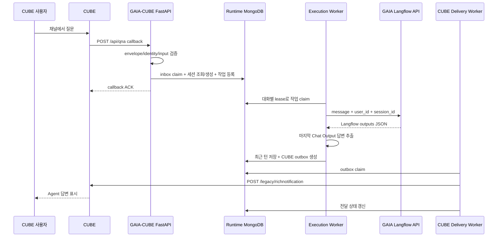

# GAIA-CUBE Server 구현 청사진

> 상태: **보류된 향후 운영 설계 메모**. 이 문서의 MongoDB, worker, outbox, 재시도와 스케줄 운영 구조는 현재 기본 API 연동 구현 범위가 아니다. 사용자가 별도 운영 설계를 요청할 때만 다시 검토한다.

## 결론

현재 제공된 GAIA와 CUBE API 형식으로 원하는 동작을 구현할 수 있다.

사용자가 CUBE의 특정 채널에서 질문하면 서버가 callback을 받고, 같은 사용자의 GAIA 권한으로 Langflow Agent를 실행한 뒤, 최종 Chat Output 텍스트를 원래 사용자와 채널에 Rich Notification으로 발송한다. 서버는 사용자·채널별 GAIA 세션 매핑과 최근 N턴을 별도로 보존하여 최근 대화를 조회할 수 있게 한다.

용어는 다음처럼 구분한다.

- **정상 응답**: GAIA Agent가 생성한 최종 답변을 CUBE로 발송하는 기본 경로
- **오류 fallback**: GAIA 실행 또는 응답 추출이 실패했을 때 검증된 사용자에게 보내는 고정 안내문
- **호환 field fallback**: GAIA 응답 JSON의 canonical 답변 필드가 없을 때 표준 Langflow Message 필드를 읽는 추출 보조 경로

정상 Agent 답변을 오류 fallback으로 취급하지 않는다.

## 목표 흐름



CUBE callback timeout과 ACK 정책이 아직 제공되지 않았으므로 위의 **빠른 ACK + durable worker** 방식이 운영 권장안이다. inbox와 실행 작업의 영속 저장이 성공한 뒤에만 성공 계열 ACK를 반환한다. 초기 개발에서는 동일 서비스 내 worker를 사용할 수 있지만, FastAPI `BackgroundTasks`만으로 처리하면 프로세스 종료 시 작업이 유실되므로 운영 완료안으로 사용하지 않는다.

## 1. CUBE Callback 수신

### Endpoint

FastAPI router 기준 경로를 다음으로 통일한다.

```text
POST /api/qna
```

CUBE Rich Message의 `callbackaddress`도 같은 경로를 사용한다. 운영 배포 시 bind 주소와 CUBE가 접근하는 callback URL은 분리해 설정한다.

### 정규화 필드

| 값 | 우선 경로 | 보조 경로 |
| --- | --- | --- |
| 사용자 | `richnotificationmessage.header.from.uniquename` | `process.userId` |
| 채널 | `richnotificationmessage.header.to.channelid[0]` | `process.channelId` |
| 일반 텍스트 | `process.processdata` | 없음 |
| Rich 선택값 | `process.<processid>` | 없음 |

header와 process에 사용자·채널이 모두 있으면 값이 일치해야 한다. callback 인증이 확인되기 전에는 payload 값만으로 권한을 신뢰하지 않는다.

### 입력 유형

1. `!@#HelloChatBot#@!`: handshake. GAIA와 CUBE 발송 없이 ignored 계열 ACK
2. `UserSelection`, `SendBtn` 등 등록된 process ID: Rich interaction
3. 비어 있지 않은 `processdata`: 일반 질문
4. 나머지: 잘못되었거나 지원하지 않는 요청

Rich interaction에서는 `processdata`가 빈 문자열이어도 정상일 수 있다.

대상 GAIA `svc_id`는 callback payload가 임의로 지정하게 하지 않는다. 인증된 CUBE bot/channel과 서버 설정의 허용 매핑으로 결정하고, 해당 사용자의 Agent 권한도 확인한다. 현재 정책은 **CUBE 채널 하나에 GAIA Agent 하나를 고정**하는 방식이다. 따라서 `svc_id`는 채널 설정에서 해석한 실행 대상이며, 같은 채널 안에서 사용자가 Agent를 선택하거나 세션 key를 나누는 값이 아니다.

## 2. Callback ACK와 사용자 답변 분리

CUBE callback에 반환하는 JSON은 CUBE 시스템에 대한 처리 ACK다. 사용자가 보는 답변은 반드시 CUBE Rich Notification 발송 API를 별도로 호출한다.

```text
ACK: FastAPI -> callback HTTP response
사용자 답변: FastAPI/worker -> CUBE /legacy/richnotification
```

현재 자료에는 `success`, `ignore`, `ignored`, `error`, `not_found`가 혼재한다. 공식 ACK enum, HTTP status와 timeout이 확인되기 전까지 내부 작업 상태와 CUBE ACK 문자열을 분리하고 설정 가능한 adapter mapping으로 둔다.

## 3. Inbox와 실행 작업

callback을 검증한 뒤 원본 payload 전체를 장기 저장하지 않고 정규화된 이벤트를 기록한다.

```text
NormalizedCubeEvent
- event_id
- event_type: text_message | rich_interaction | hello_handshake
- authenticated_user_id
- channel_id
- gaia_svc_id
- user_text 또는 interaction 값
- received_at
- conversation_key_hash
```

CUBE message/event ID가 실제 payload의 어느 필드에 있는지 아직 확인되지 않았다. 이 값 없이 callback 재전송에 대한 정확한 중복 제거는 보장할 수 없다. 운영 전 반드시 실제 event ID와 재전송 규칙을 확인한다. 단순히 `사용자 + 채널 + 메시지 문자열`만 hash하면 사용자가 같은 질문을 다시 보낸 정상 요청까지 중복으로 오인하므로 production idempotency key로 사용하지 않는다.

일반 질문 또는 처리 대상 상호작용은 `ExecutionRequest`로 변환한다.

```text
ExecutionRequest
- execution_id
- source: cube_interactive | cube_schedule
- conversation_id
- conversation_generation
- gaia_svc_id
- gaia_user_id
- gaia_session_id
- cube_user_id
- cube_channel_id
- message
- input_idempotency_key
```

### 실행과 전달 상태

GAIA와 CUBE의 timeout은 결과가 확정된 실패와 다르므로 상태를 분리한다.

```text
Execution
queued
  -> gaia_inflight
  -> gaia_succeeded | gaia_failed | gaia_outcome_unknown

Delivery
none
  -> pending
  -> sending
  -> delivered | retry_wait | delivery_unknown | dead_letter
```

현재 GAIA API에는 요청 idempotency key나 실행 상태 조회 endpoint가 확인되지 않았다. GAIA timeout 후 자동 재호출하면 같은 세션에 질문이 두 번 누적될 수 있으므로 초기 안전 정책은 재호출하지 않고 `gaia_outcome_unknown`으로 기록하는 것이다. 검증된 사용자에게는 고정 오류 fallback을 한 번 생성할 수 있지만, 숨은 실행으로 세션 문맥이 달라졌을 가능성이 있으므로 다음 질문 전에 활성 GAIA 세션 generation을 교체하는 정책을 적용한다.

## 4. 사용자·채널별 세션

### 논리 대화와 GAIA 세션 분리

하나의 CUBE 채팅에는 안정적인 `conversation_id`가 있고, 그 안에 현재 활성 GAIA `session_id`와 generation이 있다.

```text
Logical conversation
  conversation_id: 고정
  conversation_key: environment + tenant + user + channel/thread

Resolved channel-to-Agent mapping
  gaia_svc_id: 서버 채널 설정에서 결정
  channel_agent_mapping_version: 설정 변경 때 증가

Active GAIA session
  gaia_session_id: gc_<opaque UUID>
  generation: 세션 교체 때 증가
```

사번은 `X-Gaia-User-Id`와 GAIA body의 `user_id`에는 필요하지만 GAIA `session_id` 자체에 평문으로 넣지 않는다.

대화 조회 키는 scope의 canonical JSON을 HMAC-SHA-256으로 만든다. 사번·채널 route·최근 메시지는 민감정보로 분류해 암호화 저장하고, HMAC 키와 암호화 키를 분리·버전 관리한다.

채널의 `gaia_svc_id` 또는 Flow 버전 매핑이 바뀌면 같은 논리 conversation의 활성 GAIA session generation을 교체한다. 이전 Agent의 최근 문맥이 새 Agent의 입력으로 이어지지 않도록 새 generation의 활성 대화 창을 시작하고, 각 실행에는 해석된 `gaia_svc_id`와 매핑 버전을 남긴다.

### 같은 session_id의 누적 처리

사용자 실행으로 동일한 GAIA `session_id`에 대화가 계속 누적되는 것이 확인됐다. 따라서 다음 두 제한을 모두 둔다.

1. 서버 `ConversationStore`에는 최근 N턴만 유지한다.
2. Langflow의 메모리 조회도 최근 N턴으로 제한한다.

초기 권장값은 5턴이다. 실제 값은 환경 설정으로 둔다.

Langflow/GAIA에서 최근 N턴 조회를 보장할 수 없다면 비활성 시간 또는 최대 활성 턴 수에 따라 GAIA 세션 generation을 교체한다. 세션 교체가 GAIA 저장소의 과거 데이터를 삭제한다는 의미는 아니다. 실제 저장 기간과 삭제 정책은 GAIA 운영 정책을 별도로 확인해야 한다.

### 요청 순서

같은 대화에서 사용자가 메시지를 연속으로 보내면 GAIA 호출 순서가 뒤바뀌지 않도록 conversation별 lease/fencing token으로 직렬화한다. 다른 사용자의 대화는 병렬 처리한다.

## 5. GAIA 호출과 답변 추출

### 요청

```text
POST http://gaia.example.internal/v2/agents/{svc_id}/external
X-Gaia-Auth-Key: <secret>
X-Gaia-User-Id: <authenticated employee id>
Content-Type: application/json
```

```json
{
  "message": "사용자 질문",
  "user_id": "인증된 사용자 사번",
  "session_id": "활성 GAIA 세션 ID"
}
```

header 사용자와 body 사용자는 항상 같아야 한다.

### 최종 답변

루트와 내부 `outputs`를 뒤에서부터 순회하여 마지막 `Chat Output`을 선택한다. 선택한 출력에서는 다음 경로를 우선 사용한다.

```text
results.gaia_response.data.answer
```

없으면 `results.message.data.gaia_response.answer`, `results.message.data.text` 등의 문서화된 호환 경로를 순서대로 확인한다. 최종 출력이 오류이거나 텍스트가 없으면 이전 Chat Output을 대신 보내지 않고 실행 실패로 처리한다.

보존할 정규화 결과는 다음과 같다.

```text
GaiaExecutionResult
- answer_text
- session_id
- flow_id
- run_id
- graph_run_id
- trace_id
- metadata
- elapsed_ms
```

GAIA 원본 응답 전체를 최근 대화에 넣지 않는다.

## 6. CUBE 답변 발송

정상 답변과 사용자 오류 fallback은 같은 `CubeContentBuilder`를 사용하여 완전한 Rich Notification schema로 만든다.

```text
to.uniquename = [원래 callback 사용자]
to.channelid = [원래 callback 채널]
control.text = [GAIA 최종 답변 또는 고정 fallback 문구]
```

발송 payload의 봇 토큰과 메시지 원문을 로그에 남기지 않는다.

CUBE 발송 결과는 다음처럼 정규화한다.

```text
CubeDeliveryResult
- status: delivered | retryable_failure | permanent_failure | unknown_delivery
- http_status
- provider_message_id
- safe_error_code
```

timeout은 CUBE가 요청을 접수했지만 응답만 유실된 `unknown_delivery`일 수 있다. CUBE 멱등성 정책이 확인되기 전에는 즉시 같은 정상 답변이나 fallback을 추가 발송하지 않는다.

## 7. Fallback 정책

| 실패 | 사용자 fallback | 이유 |
| --- | --- | --- |
| malformed callback | 보내지 않음 | 사용자·채널을 신뢰할 수 없음 |
| callback 인증 실패 | 보내지 않음 | 공격자가 임의 대상 발송을 유도할 수 있음 |
| HelloChatBot handshake | 보내지 않음 | 제어 이벤트 |
| GAIA 인증/확정 실행 실패 | 고정 안내문 1회 | 검증된 사용자가 기다리고 있음 |
| GAIA timeout/결과 불명 | 고정 안내문 1회 가능, 자동 재호출 금지 | 중복 실행과 숨은 세션 문맥 변경 위험 |
| GAIA 최종 답변 추출 실패 | 고정 안내문 1회 | 정상 답변이 없음 |
| CUBE 발송 실패/timeout | 즉시 fallback 금지 | 같은 발송 경로도 실패하며 중복 메시지 위험 |

권장 고정 안내문:

```text
요청을 처리하지 못했습니다. 잠시 후 다시 시도해 주세요.
```

내부 예외 문자열, URL, 토큰 또는 stack trace를 callback 응답과 사용자 fallback에 포함하지 않는다.

## 8. 최근 대화 조회

현재 제공된 GAIA API에는 세션 대화내역 조회 endpoint가 없다. 따라서 사용자가 원하는 “세션 대화내용 확인” 기능은 서버의 `ConversationStore`에 저장한 최근 N턴을 기준으로 제공한다.

### 저장 범위

- 사용자 질문
- GAIA 최종 답변
- turn/execution ID
- 생성 시간
- 전달 상태의 요약

저장하지 않는 값:

- GAIA/CUBE 인증 토큰
- 전체 callback 원본
- 전체 GAIA 원본 응답
- 최근 N턴을 초과한 메시지 본문

### 내부 조회 API 제안

```text
GET  /api/v1/me/conversations
GET  /api/v1/me/conversations/{conversation_id}/recent-turns
POST /api/v1/me/conversations/{conversation_id}/reset

GET  /internal/v1/conversations/{conversation_id}/diagnostics
GET  /internal/v1/executions/{execution_id}
```

- 본인 conversation 조회: 활성 generation, 마지막 활동 시각, 최근 턴 수와 상태
- recent-turns 조회: 인증된 본인의 최근 N턴만 반환
- reset: 새 GAIA `session_id`를 발급하고 generation 증가
- internal diagnostics: GAIA 실행과 CUBE 전달 상태, 안전한 오류 코드

일반 사용자 endpoint는 SSO/JWT 등의 인증 주체에서 본인 identity를 결정하고, URL이나 query로 사번을 받지 않는다. 운영자 endpoint는 별도 권한과 감사 로그가 필요하다. 일반 사용자에게 실제 GAIA `session_id`, 사번, 암호화 route와 내부 trace 정보를 반환하지 않고 opaque `conversation_id`를 사용한다.

향후 CUBE에서 “최근 대화 보기” 기능이 필요하면 위 내부 API를 직접 노출하지 않고, 인증된 CUBE 사용자 요청을 같은 service 계층으로 전달하는 별도 Rich Message 기능을 추가한다.

## 9. Runtime MongoDB 모델

| 컬렉션 | 역할 | 메시지 본문 보존 |
| --- | --- | --- |
| `conversation_sessions` | CUBE 사용자·채널과 활성 GAIA 세션 매핑, 채널 Agent 설정 버전, 최근 N턴 | 최근 N턴만 |
| `inbox_events` | callback 중복 방지와 접수 상태 | 최소 정규화 입력 또는 암호화된 실행 참조 |
| `executions` | GAIA 실행 상태와 정규화 결과 | 현재 실행 질문/답변, 별도 TTL 적용 |
| `cube_outbox` | CUBE 발송, retry, unknown delivery, dead-letter | 발송에 필요한 최소 본문 |
| `scheduler_runs` | 스케줄 실행 상태 | 스케줄 질문/정규화 결과 최소 범위 |

### 필수 인덱스

- `conversation_sessions`: `conversation_key_hash` unique
- `inbox_events`: 실제 CUBE event scope 기반 idempotency key unique
- `executions`: `(conversation_id, created_at)`
- `cube_outbox`: `(status, next_attempt_at)`, `(execution_id, response_kind)` unique
- TTL index: 삭제 전용 `purge_at` 필드가 있는 실행/inbox/outbox에 정책별 적용

활성 세션의 `expires_at`에는 TTL index를 걸어 논리 대화 문서 자체를 자동 삭제하지 않는다. 조회 시 만료를 확인하고 CAS로 GAIA session generation을 교체한다. MongoDB TTL 삭제는 즉시 실행되지 않으므로 삭제 대상도 애플리케이션 조회 조건에서 제외한다.

답변 저장과 outbox 생성은 MongoDB transaction으로 연결하는 것이 권장된다. 운영 MongoDB가 replica set이 아니어서 transaction을 지원하지 않으면 deterministic outbox ID와 unique index를 사용하고, `gaia_succeeded`인데 outbox가 없는 실행을 복구하는 reconciliation worker를 둔다.

## 10. 권장 모듈 구조

```text
gaia_cube_server/
├─ README.md
├─ IMPLEMENTATION_BLUEPRINT.md
├─ base_guide/
├─ app/
│  ├─ __init__.py
│  ├─ main.py
│  ├─ config.py
│  ├─ dependencies.py
│  ├─ api/
│  │  ├─ cube_callback.py
│  │  ├─ conversations.py
│  │  └─ health.py
│  ├─ domain/
│  │  ├─ models.py
│  │  ├─ errors.py
│  │  └─ ports.py
│  ├─ services/
│  │  ├─ callback_service.py
│  │  ├─ execution_service.py
│  │  ├─ conversation_service.py
│  │  ├─ delivery_service.py
│  │  └─ fallback_policy.py
│  ├─ adapters/
│  │  ├─ real/
│  │  │  ├─ gaia_http.py
│  │  │  ├─ cube_http.py
│  │  │  ├─ cube_callback_verifier.py
│  │  │  └─ mongo_store.py
│  │  └─ dummy/
│  │     ├─ gaia_client.py
│  │     ├─ cube_client.py
│  │     ├─ callback_verifier.py
│  │     └─ memory_store.py
│  └─ workers/
│     ├─ execution_worker.py
│     ├─ cube_delivery_worker.py
│     └─ scheduler_worker.py
├─ tests/
│  ├─ contract/
│  ├─ unit/
│  └─ integration/
├─ __main__.py
└─ .env.example
```

서비스 계층은 HTTP, MongoDB와 FastAPI 객체를 직접 참조하지 않고 `GaiaClient`, `CubeClient`, `CubeCallbackVerifier`, `ConversationStore`, `InboxStore`, `ExecutionStore`, `OutboxStore` port에만 의존한다.

## 11. 운영 구현과 더미 구현

실행 모드는 명시적으로 선택한다.

```text
production: 실제 GAIA/CUBE HTTP + MongoDB
dummy: fixture GAIA 응답 + CUBE 발송 capture + in-memory store
```

- production 설정에서 endpoint, 인증 또는 MongoDB가 빠지면 readiness 실패
- production이 자동으로 dummy로 전환되는 동작 금지
- dummy는 외부 네트워크를 호출하지 않음
- 두 모드에 같은 callback parser, session, response extraction, content builder와 fallback policy 사용
- real/dummy adapter에 같은 contract test 적용

현재 프로젝트에는 `requests`가 있지만 FastAPI async endpoint에서 직접 호출하면 event loop를 막는다. 구현 시 async HTTP client 의존성을 추가하거나 동기 호출을 명시적으로 thread 격리한다. 운영 권장안은 재사용 가능한 async client다.

## 12. 스케줄 실행 연결

스케줄러도 별도 GAIA/CUBE 코드를 만들지 않고 같은 `ExecutionRequest` 파이프라인을 사용한다.

```text
due schedule
  -> source=cube_schedule ExecutionRequest
  -> GAIA 실행
  -> 최종 답변 추출
  -> 동일 CUBE outbox
  -> 요청자/채널 발송
```

스케줄 실행은 대화형 최근 문맥에 영향을 받지 않도록 기본적으로 실행마다 별도 GAIA `session_id`를 사용한다. 스케줄별 연속 문맥이 명시적으로 필요할 때만 `schedule_id` 단위 세션을 재사용한다.

## 13. 최소 검증 시나리오

### 정상

1. 서로 다른 사용자/채널은 서로 다른 conversation과 GAIA 세션을 사용한다.
2. 같은 사용자/채널의 연속 질문은 채널 Agent 설정이 바뀌지 않은 동안 같은 활성 GAIA 세션을 사용한다.
3. GAIA의 마지막 Chat Output만 CUBE에 발송한다.
4. 최근 N턴을 넘으면 가장 오래된 턴부터 제거된다.
5. 최근 대화 조회 API는 저장된 N턴과 실행/전달 상태를 반환한다.

### 제어/오류

1. HelloChatBot sentinel은 GAIA와 CUBE 발송을 호출하지 않는다.
2. malformed 또는 identity 불일치 callback은 GAIA와 fallback을 호출하지 않는다.
3. GAIA 인증 또는 확정 실행 오류는 검증된 route에 고정 fallback outbox를 한 번만 만든다.
4. GAIA timeout은 `gaia_outcome_unknown`이며 자동 재호출하지 않고 정책에 따라 다음 요청 전에 generation을 교체한다.
5. GAIA 응답 추출 실패 시 이전 Chat Output을 사용하지 않는다.
6. CUBE timeout은 `unknown_delivery`이고 GAIA를 다시 실행하지 않는다.
7. CUBE 확정 실패는 retry/backoff/dead-letter로 이동한다.
8. 중복 callback은 같은 GAIA 실행을 다시 만들지 않는다.
9. 세션 reset 중 진행 중인 오래된 generation 결과는 새 대화에 기록되지 않는다.

### 운영/더미 동등성

1. 동일 callback fixture가 같은 `NormalizedCubeEvent`를 만든다.
2. 동일 GAIA fixture가 같은 최종 답변을 만든다.
3. 동일 답변이 같은 CUBE Rich Notification payload를 만든다.
4. production 설정 실패가 dummy fallback 없이 readiness 실패가 된다.

## 14. 운영 전 반드시 확인할 정보

다음 정보가 없어도 core/dummy 구현은 가능하지만 production 완료 판정은 할 수 없다.

1. CUBE callback 인증/서명 또는 송신자 검증 방식
2. CUBE callback message/event ID와 재전송 정책
3. CUBE callback ACK status, HTTP status와 timeout
4. CUBE 발송 API의 성공/오류 body, timeout 의미와 idempotency 지원
5. `cubeuniquename`, `cubechannelid`, `userId`, `channelId`의 공식 변환 규칙
6. GAIA 오류 response schema, timeout/재시도 정책과 rate limit
7. GAIA 세션 보존·삭제 정책과 Langflow 최근 N턴 메모리 설정
8. CUBE 채널과 고정 GAIA `svc_id`의 매핑, 매핑 변경 절차와 사용자 권한 규칙
9. 최근 대화 조회 API의 사용자/운영자 인증과 보존 기간
10. 운영 MongoDB topology, transaction 지원과 암호화 정책
11. CUBE 메시지 최대 길이와 긴 GAIA 답변의 분할·여러 메시지 발송 규칙

## 15. 구현 순서

1. domain model, parser, port와 dummy adapter 구현
2. dummy callback -> GAIA fixture -> CUBE payload capture end-to-end 검증
3. MongoDB conversation/inbox/execution/outbox 구현과 contract test
4. 실제 GAIA async client와 응답 추출기 연결
5. 실제 CUBE async client와 Rich Notification builder 연결
6. FastAPI callback, health/readiness와 최근 대화 조회 API 연결
7. worker lease, retry, unknown delivery와 dead-letter 검증
8. 운영 API 정책을 반영한 인증·ACK·멱등성 보완
9. 실제 운영망 opt-in smoke test
10. 같은 execution pipeline에 scheduler 연결
